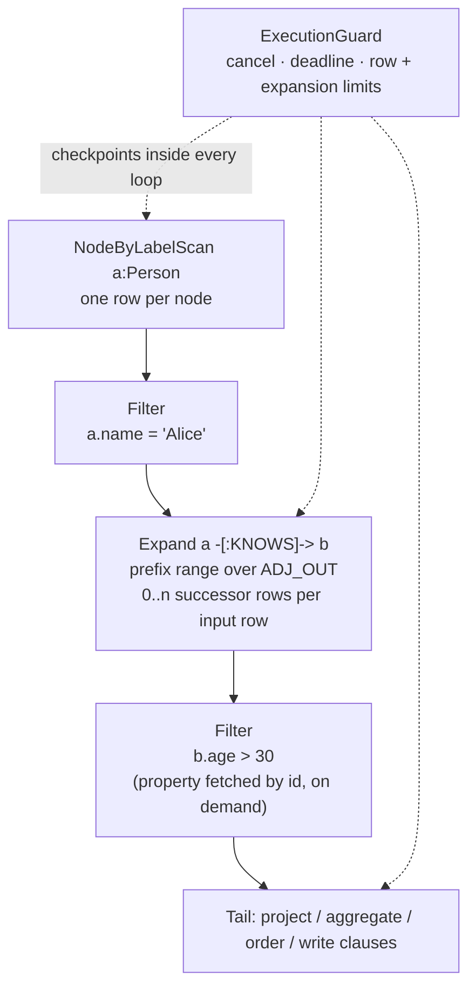

# The Executor

The executor (`marsdb-query/src/executor.rs`, plus four helper modules
for arithmetic, scalar functions, temporal functions, and value
comparison) turns a logical plan into rows and applies everything the
plan does not cover: projection, aggregation, ordering, write clauses,
and the enforcement of execution bounds. It is the largest component
in MarsDB, and the reason is not algorithmic sophistication — it is
that it implements most of Cypher's detailed semantics.

## Rows and bindings

The unit of data flow is a `BindingRow`: a map from variable name to
`Binding`, where a binding is a node reference, an edge reference, a
computed value, a list, or a path. Operators take a vector of rows and
produce a vector of rows; a scan produces one row per node, an
`Expand` produces zero or more successor rows per input row, a
`Filter` drops rows. Nodes and edges travel as *ids*, not
materialized records — properties are fetched on demand through the
single-property read path from chapter 3, which is exactly why that
path's performance matters.

Two hidden binding keys never visible to user Cypher do structural
work: one correlates `OPTIONAL MATCH` result rows back to the outer
row that seeded them (so left-outer null-padding can be applied to
precisely the outer rows that matched nothing), and one tags whether
a `MERGE` row came from the create path or the match path, consumed
and stripped before the row becomes visible — that is how `ON CREATE
SET` and `ON MATCH SET` know which branch each row took.

## Walking the plan

Plan evaluation is a recursive walk. Scans iterate `NODES`, the label
index, or a property-index lookup; `Expand` turns each input row's
bound node into a prefix range over `ADJ_OUT` or `ADJ_IN` (both, with
dedup by edge id, for undirected hops) using the bounds functions
from chapter 3. `VarExpand` runs a bounded BFS per input row,
threading the pattern-wide excluded-edge set that enforces edge
isomorphism across hops.

`OPTIONAL MATCH` wraps its whole sub-plan in left-outer semantics:
outer rows that produced matches keep them; outer rows that produced
none are padded with `Null` for exactly the variables the optional
pattern would have *newly* bound — a repeated variable keeps its
existing binding, which is what makes `OPTIONAL MATCH (a)-[r]->(b)`
with an already-bound `a` mean "extend this `a`, or null out `r` and
`b`."

## Bounded execution

Every long-running loop in the walk calls into an `ExecutionGuard`,
which enforces the caller's `ExecutionOptions` cooperatively:

- **Cancellation** — a cloneable token backed by an atomic bool,
  flippable from another thread; the guard checks it at loop
  checkpoints.
- **Timeout** — a deadline computed once, compared at the same
  checkpoints.
- **Row and expansion limits** — intermediate-row count, result-row
  count, and a relationship-expansion counter that increments per
  adjacency entry walked.

The design point is *where* these are checked: during plan
evaluation, not after materialization. A runaway
`MATCH (a)-->(b)-->(c)` errors when it *exceeds* the bound, instead
of building an unbounded intermediate result first and truncating it
after the memory damage is done. There is no preemption and no
watchdog thread — the same no-background-threads rule as everywhere
else — so bounds are as granular as the checkpoints, which is the
inherent cost of cooperative enforcement.

The guard carries one more piece of state with a story: a map of
deleted edge ids to their type names. Cypher permits `type(r)` to be
read *after* `DELETE r` earlier in the same statement — a
relationship's type is immutable for its lifetime, so it needs no
live record — while reading a deleted edge's *properties* is an
error. The delete path records each edge's type just before removal,
and `type()` falls back to that map only when the live lookup fails.
This is the kind of semantic detail that no amount of first-principles
design produces; it came from conformance testing, and the code
comment cites the exact test scenarios.

## Expressions and three-valued logic

Predicate and projection evaluation implement Cypher's SQL-style
three-valued logic: a comparison involving `null` is unknown, unknown
propagates through `AND`/`OR` by the usual truth tables, and a `WHERE`
keeps only rows whose predicate is definitely true. The planner
chapter already showed one place this bites (a `NOT` over a
collapsed-to-false unknown would flip it to true); the executor is
where the discipline is enforced uniformly, in the value-comparison
module every operator shares.

Values are dynamically typed, and type errors are *runtime* errors by
design (chapter 5's semantic pass checks only structural kinds).
Comparison across incompatible types is `false` rather than an error
— matching Cypher — while arithmetic on wrong types errors with a
typed `QueryError::Type`.

## Aggregation

Cypher has no `GROUP BY` keyword: in an aggregating `RETURN` or
`WITH`, the non-aggregate items *are* the grouping key. The executor
folds rows into groups keyed by those items' values, driving one
accumulator per aggregate item per group — `count`, `sum`, `avg`,
`min`, `max`, `collect`, with `DISTINCT` variants tracked per
accumulator.

Grouping needs hashable keys, and MarsDB's value type cannot derive
`Eq`/`Hash` — it contains `f64`, which Rust's standard library
correctly refuses to hash (IEEE floats have no reflexive equality).
The solution is a parallel `HashKey` type that hashes floats *by bit
pattern*, with the trade-offs documented at the definition: ordinary
float grouping is unaffected (equal floats have equal bits), while at
the edges `NaN` groups with `NaN` (unlike IEEE `NaN != NaN`) and
`+0.0`/`-0.0` land in distinct groups. Nodes and edges hash by id —
graph identity, consistent with equality elsewhere. `DISTINCT`'s
seen-set uses the same type: same problem, same fix, one definition.

## The two output lanes

Materialized execution — the default — produces a `QueryResult`:
column names, rows of values, and per-statement write statistics.
`ORDER BY`, `SKIP`, `LIMIT`, and `DISTINCT` apply at this stage,
against projected columns (which is why an `ORDER BY` key can
reference a projection alias).

The streaming lane (`execute_streaming_with_options`) pushes rows one
at a time into a caller-supplied sink, with bounded memory regardless
of result size. Its contract is strict by design: it accepts exactly
the shapes that can stream without materialization — a single plain
`MATCH ... RETURN`, `SKIP`/`LIMIT` permitted — and *errors* on
`ORDER BY`, aggregation, `DISTINCT`, or `WITH`. Those constructs must
see every row before emitting any; silently materializing them would
violate the API's bounded-memory contract, so MarsDB
prefers a refusal over a lie. Row-count limits double as early
termination: a sink that returns "stop" ends the scan.

Write clauses (`CREATE`, `MERGE`, `SET`, `DELETE`, `REMOVE`) execute
against the same row stream — for each row the pattern bound, apply
the mutation through the `_in_txn` layer from chapter 4, inside the
statement's one transaction — and count their effects into the
statement's `QueryStats`.

The next chapter follows a finished result out of the process: how
rows cross the C ABI, and how they become Arrow record batches,
Python objects, and Go maps without being copied more times than
necessary.
