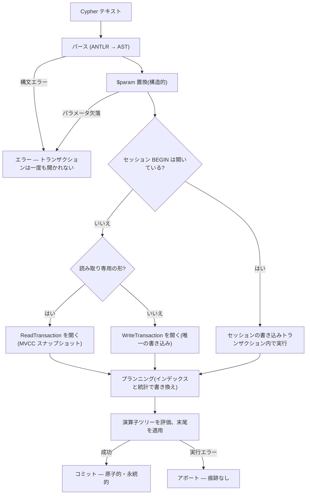

# 設計概要

MarsDB は組み込み型のプロパティグラフデータベースです: プロセス内で
動作する Rust ライブラリで、グラフ全体を 1 つのファイル(または純粋な
インメモリ)に格納し、openCypher のクエリに応答します。サーバも
ネットワークプロトコルもバックグラウンドスレッドもありません —
データベースが行うすべての仕事は、呼び出し側の関数呼び出しの中で
起こります。SQLite を使ったことがあれば、この形はおなじみでしょう。
MarsDB はそれをプロパティグラフモデルに適用します: ラベルと
プロパティを持つノード、型とプロパティを持つ有向リレーションシップ、
そしてパターンマッチングを中心に組み立てられたクエリ言語です。

この章では、クレート構成、ひとつの文が処理される流れ、トランザクション
モデルを概観します。以降の章では、この全体図を領域ごとに詳しく見て
いきます。

## クレート構成

MarsDB は、少数のクレートを階層化したワークスペースです。各層が依存する
のは、原則として直下の層だけです。

```
marsdb-cli       `mars` バイナリ: REPL とワンショット実行
marsdb           公開組み込み API: Database、Transaction、セッション
marsdb-query     Cypher テキスト -> AST -> 論理プラン -> エグゼキュータ
marsdb-graph     プロパティグラフモデル: レコード、エンコード、インデックス、CRUD
marsdb-storage   組み込み KV エンジン (redb) の上の薄い境界
```

```mermaid
flowchart BT
    storage["marsdb-storage — redb の上の薄い境界"]
    graph["marsdb-graph — レコード、エンコード、インデックス、CRUD"]
    query["marsdb-query — Cypher → AST → プラン → エグゼキュータ"]
    core["marsdb — Database、Transaction、セッション"]
    cli["marsdb-cli — mars バイナリ"]
    capi["marsdb-capi — C ABI"]
    py["marsdb-python — PyO3"]
    redb[("redb — B-tree ファイル、MVCC")]
    storage --> redb
    graph --> storage
    query --> graph
    core --> query
    cli --> core
    capi --> core
    py --> core
```

この構成には、以降の設計を方向づける重要な特徴が 2 つあります。

**ストレージエンジンは自作せず、既存のものを利用する。** `marsdb-storage` は
[redb](https://github.com/cberner/redb) — ACID トランザクション、
MVCC スナップショット、B-tree ファイル形式を備えた純 Rust の
単一ファイルの組み込みキーバリューストア — をラップする薄い層です。
堅牢でクラッシュ耐性のあるストレージエンジンを作ること自体が数年がかりの
プロジェクトであり、しかもバグが最も許されず最も見つけにくい層です。
実績あるエンジンを土台にすることで、エンコーディング、プランニング、
実行というグラフデータベース固有の課題に集中できます。fsync を正しく
扱うための難題は、すでに redb 側で解決されています。その代わり、redb の制約を
受け入れることで、最も重要なのは並行性モデルです: 読み取りは同時に
いくつでも、しかし書き込みはプロセス全体で同時に 1 つだけ。この
single-writer ルールは、セッション層からエグゼキュータのロック順序まで、
設計全体に影響します。`marsdb-graph` は redb を直接 import しません。
`marsdb-storage` という小さな境界を介して依存関係を明確にし、将来
ストレージエンジンを差し替える場合にも変更範囲を限定できるようにしています。

**クエリ言語は AST の解釈ではなく、エンジンの形をした IR へ
コンパイルされる。** `marsdb-query` は Cypher をパースし(ANTLR 文法が
生成するパースツリーを visitor で AST へ)、検証し、各 `MATCH`
パターンを小さな論理演算子ツリー — `AllNodesScan`、`NodeByLabelScan`、
`IndexSeek`、`IndexRangeSeek`、`EdgeTypeScan`、`Seed`、`Expand`、
`VarExpand`、`Filter` — に変換（lowering）し、エグゼキュータがそれを
ストレージに対して評価します。演算子が Cypher の形ではなく
「グラフをどう歩くか」というトラバーサルの形をしているのは意図的です。
それにより、プランナはアクセスパスの置き換え(ラベルスキャンを
インデックスシークに、アンカー付き展開をエッジ一括スキャンに)を、
エグゼキュータがプランの出所を気にすることなく行えます。

## 文が処理されるまで

データベースが行うすべては 1 つの入口から到達できます:
`marsdb/src/lib.rs` の `Database::execute`(およびパラメータと
オプションを受け取る派生メソッド）です。1 回の呼び出しを最初から
最後まで追うと、すべての層を通過します。

1. **パース。** Cypher テキストが生成されたパーサと AST 構築 visitor を
   通ります。構文エラーはここで停止し、ストレージには何も触れて
   いません。

2. **パラメータ置換。** `$name` プレースホルダが、呼び出し側の
   パラメータマップから AST 内で置き換えられます。これは文字列の
   継ぎ接ぎではなく構造的な置換です — パラメータ値がクエリの形を
   変えることは決してできず、パラメータ化クエリが構造上
   インジェクション不能なのはこのためです。

3. **セッション層でのルーティング。** `Database` ハンドルは、Cypher
   レベルの `BEGIN` トランザクションが開いているかを確認します。
   開いていれば文はそのトランザクション内で実行され(未コミットの
   書き込みも見えます)、開いていなければ文は自動コミットです:
   その文の存続期間だけのトランザクションを得ます。このチェックを
   守るロックは自動コミット実行の開始前に解放されるため、1 つの
   ハンドル上の並行読み取りは実際に並行実行されます。

4. **正しい種類のトランザクションを開く。** エグゼキュータは文を
   分類します: 読み取り専用の形(書き込み句のない
   `MATCH ... RETURN`)は redb の*読み取り*トランザクション —
   他の読み取りや同時に 1 つの書き込みと共存する一貫した MVCC
   スナップショット — を開き、書き込むものは redb が同時に 1 つだけ
   許す*書き込み*トランザクションを開きます。

5. **プランニング。** パターンを論理演算子ツリーへ変換し、次に
   ストレージを見ながら書き換えられます: 宣言済みインデックスが
   あればラベルスキャン上のフィルタがインデックスシークになり、
   コスト統計に基づいて開始点が反転されることがあり、述語と LIMIT が
   スキャンへ向けて押し下げられます。プランニングは実行のたびに、
   文のトランザクションの中で行われます — だからプランは、まさに
   このスナップショットが見られるインデックスと統計を反映します。

6. **評価。** エグゼキュータは演算子ツリーを歩き、変数をノード・
   リレーションシップ・値に行ごとに束縛し、文の末尾(射影、集約、
   整列、制限、あるいは書き込み句 `CREATE`、`SET`、`DELETE`、...)を
   適用します。書き込み句は同じトランザクション内で `marsdb-graph` の
   CRUD 層を通じてストレージを変更します。

7. **コミットまたはアボート。** 成功すればコミット — redb が文の
   効果全体を原子的に永続化します。実行エラーはトランザクションを
   アボートします: 途中で失敗した文は痕跡を残しません。この文単位の
   all-or-nothing 境界がデータベースの基本的なクラッシュ安全性の
   契約であり、3000 ノードを作った文にも 1 ノードの文にも等しく
   成り立ちます。



このパイプラインで重要なのは境界の位置です。パースとパラメータの
エラーはトランザクションが存在する前に起き、プランニングは自分の
スナップショットを信頼できるようトランザクションの中で行われ、
そして 1 つの文は、呼び出し側が明示的に別段の指定をしない限り、
常に正確に 1 つの原子的単位です — それが次のトランザクション
モデルの話につながります。

## トランザクションモデル

MarsDB は 1 つのストレージレベルの現実 — redb の
single-writer/many-readers MVCC — を、3 つの呼び出し側向けの形で
公開します。すべて `marsdb/src/lib.rs` に定義されています:

**自動コミット**は上で述べた既定です: 1 文 = 1 トランザクション。
設定するものは何もなく、半分だけ適用された文を観測する方法も
ありません。

**呼び出し側所有のトランザクション**(`Database::begin_transaction`)は、
複数の `execute` 呼び出しにまたがる書き込みトランザクションを所有する
`Transaction` ハンドルを返し、明示的にコミットまたはロールバック
します。ハンドル経由の読み取りは、そのトランザクション自身の
未コミットの書き込みを見ます。文のエラーはトランザクション全体を
即座にアボートし、開いたまま残しません — 意図的な立場です: 失敗した
文は失敗の前に部分的な効果を適用済みかもしれず、それは決して
コミット可能であってはなりません。エラー処理は、すべての呼び出し側が
ロールバックを覚えていることを信頼するのではなく、不正な状態を
表現不能にします。

**セッショントランザクション**は同じ考えをクエリ言語の*内側*から
駆動します: 通常の文としての `BEGIN`、`COMMIT`、`ROLLBACK`
(openCypher 自体にトランザクション文はないため、拡張です)。これに
より CLI や、「文字列を実行する」API しか持たない言語バインディング
からトランザクションが使えます。`Database` ハンドル 1 つが 1
セッションです: `BEGIN` が書き込みトランザクションを開き、以降の文は
`COMMIT` か `ROLLBACK` までその中で実行されます。実行エラーでの
アボートという同じ立場が適用されますが、1 つだけ例外があります:
そもそも*実行されなかった*文 — パースエラーや欠けたパラメータ — は
トランザクションを開いたままにします。何も適用されていないのに、
何も変更されていないのに、入力ミスひとつで対話セッションの
トランザクションを破棄する必要はないからです。

セッション形式には、single-writer という制約に由来する注意点が
あります。開いたセッショントランザクションはプロセス唯一の書き込み
スロット*そのもの*なので、放置されたものは他のすべての書き込みを
永遠にブロックします — redb の `begin_write` はエラーを返さず
ブロックするのです。MarsDB はこれをオプションのアイドルタイムアウトで
緩和しますが、その機構は注目に値します。全体で使われる設計ルールの
実例だからです: **バックグラウンドスレッドを持たない**。期限切れは
リーパースレッドではなく、そのセッションに次に到着した文が遅延
チェックします。データベースは呼び出し側のコールスタックの外で仕事を
しません。それが組み込みの話を単純に保ちます(シャットダウン順序も、
ホストプロセスに課すスレッド安全義務もない)— 代償は、期限切れ
トランザクションの回収が最速でも「次の文」になることです。

バッチはこのすべてと合成できます。`execute_batch` はセミコロン区切りの
スクリプトを、全体を先にパースし(どこかに構文エラーがあれば何も
実行されない)、文ごとに 1 トランザクションで実行します — ただし
スクリプト自身が `BEGIN ... COMMIT` と言えば、対話時とまったく同じに
動きます。`execute_batch_grouped` は、文ごとではなくグループごとに
コミットすることで、クラッシュ安全性の粒度をロードスループットと
引き換えにします。このトレードオフは実測でも確認されています。コミット 1 回は fsync
1 回であり、9,771 文の実ロードスクリプトで、文ごとのコミットは
69.1 秒、100 文グループは 13.4 秒 — そしてスクリプト全体を 1 グループで
コミットしても 12.1 秒にしかなりません。利得の大半は数百文/グループで
既に得られています。推奨グループサイズに上限を与えたのは直感ではなく
この数値です。

## 名前を与えるべき設計原則

このコードベースで繰り返し現れる習慣が 3 つあり、以降の章は主に
その実例を見せていくことになります。

**エラーは明示し、不変条件は構造によって保証する。** 不変条件が設計上
成り立つ場合 — インデックスエントリがダングリングし得ないのは、
そのテーブルに触る 2 つの関数だけが同一トランザクション内で
インデックスを維持するから — コードは「あり得ないはず」の状態を
黙って修復するのではなく、破られたらパニックします。到達不能な状態の
ための防御コードはバグを隠し、パニックはバグを晒します。

**性能の主張には計測が要る。** 本書で述べるすべてのトレードオフ —
インデックス維持コスト対スキャン高速化、グループコミットの
スループット、アクセスパス選択 — は、明記されたワークロードで
計測された、リポジトリのベンチマークスイートの数値で文書化されて
います。いくつかの設計判断は、当初魅力的だった選択肢に*逆らって*
下されました。計測がそう言ったからです。締めくくりのケーススタディ
章がそれらを集めています — 完全に実装され、約 2% と計測され、削除
された最適化を含めて。

**データベースは自分自身を説明する。** プランナの選択は観測可能で
(`EXPLAIN`)、スキーマは内省可能で(`CALL db.labels()` など)、実行は
制限・観測可能です(行数制限、タイムアウト、キャンセル、オブザーバ
フック)。問い詰められないデータベースは、迷信でデバッグする
データベースです。

全体像をつかんだところで、次章ではスタックの最下層、すなわちファイルの
中に実際に何が格納されているのかを見ていきます。
