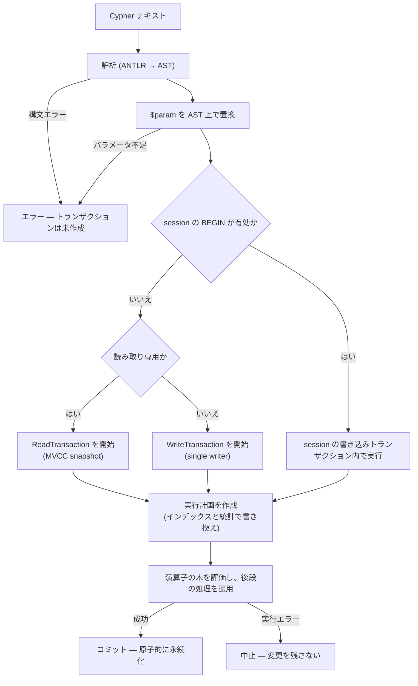

# 設計概要

MarsDB は、アプリケーションのプロセス内で動作する組み込み型のプロパティグラフ
データベースです。Rust ライブラリとして利用し、グラフ全体をひとつのファイル、
またはメモリ上に保存して openCypher のクエリを実行します。サーバー、ネットワーク
プロトコル、バックグラウンドスレッドはありません。すべての処理は、呼び出し側が
実行した関数の中で完了します。

SQLite と同じ組み込み方式を、プロパティグラフへ適用したものと考えられます。
データモデルは、ラベルとプロパティを持つノード、型とプロパティを持つ有向
リレーションシップで構成されます。クエリではグラフパターンを指定して検索します。

この章では、クレート間の依存関係、ひとつの文を処理する流れ、トランザクション
モデルを概観します。後続の章で各部分を詳しく説明します。

## クレート構成

MarsDB は複数のクレートを層に分けています。各層は原則として直下の層だけに依存します。

```text
marsdb-cli       `mars` コマンド: REPL と単発実行
marsdb           組み込み用公開 API: Database、Transaction、session
marsdb-query     Cypher テキスト -> AST -> 論理実行計画 -> 実行エンジン
marsdb-graph     グラフモデル: レコード、エンコーディング、インデックス、CRUD
marsdb-storage   組み込み KV エンジン redb への薄い抽象層
```

```mermaid
flowchart BT
    storage["marsdb-storage — redb への薄い抽象層"]
    graph["marsdb-graph — レコード、エンコーディング、インデックス、CRUD"]
    query["marsdb-query — Cypher → AST → 実行計画 → 実行エンジン"]
    core["marsdb — Database、Transaction、session"]
    cli["marsdb-cli — mars コマンド"]
    capi["marsdb-capi — C ABI"]
    py["marsdb-python — PyO3"]
    redb[("redb — B-tree ファイル、MVCC")]
    storage --> redb
    graph --> storage
    query --> graph
    core --> query
    cli --> core
    capi --> core
    py --> core
```

この構成には 2 つの重要な方針があります。

**ストレージエンジンには redb を使う。** `marsdb-storage` は、Rust で実装された
単一ファイルのキーバリューストア [redb](https://github.com/cberner/redb) を
ラップします。redb は ACID トランザクション、MVCC スナップショット、B-tree の
ファイル形式を提供します。永続性とクラッシュ耐性を備えたストレージエンジンを
独自に実装せず、MarsDB はグラフのエンコーディング、実行計画、クエリ実行に集中します。

一方、並行性は redb の仕様に従います。読み取りは複数同時に実行できますが、
書き込みはプロセス全体で同時にひとつだけです。この single-writer 制約は、session の
管理やロックの取得順序にも影響します。`marsdb-graph` は redb を直接 import せず、
`marsdb-storage` の小さなトレイトだけを使います。これにより依存範囲を限定し、
将来ストレージエンジンを変更する場合の修正箇所を集約しています。

**Cypher の AST を直接実行しない。** `marsdb-query` は ANTLR で Cypher を解析して
AST を作り、意味を検証した後、各 `MATCH` パターンを論理演算子の木へ変換します。
主な演算子は `AllNodesScan`、`NodeByLabelScan`、`IndexSeek`、
`IndexRangeSeek`、`EdgeTypeScan`、`Seed`、`Expand`、`VarExpand`、`Filter` です。

演算子は Cypher の構文ではなく、グラフへのアクセス方法を表します。そのため
プランナは、ラベル走査をインデックス検索へ、ノードを起点とする展開をエッジテーブルの
逐次走査へ置き換えられます。実行エンジンは、実行計画がどの書き換えによって作られたかを
意識せずに評価できます。

## 文を実行する流れ

主な入口は `marsdb/src/lib.rs` の `Database::execute` と、パラメータや実行オプションを
受け取る派生メソッドです。1 回の呼び出しは次の順で処理されます。

1. **解析。** Cypher の文字列を生成済みパーサへ渡し、visitor が AST を構築します。
   構文エラーがあればここで終了し、ストレージにはアクセスしません。

2. **パラメータ置換。** AST 内の `$name` を、呼び出し側が渡した値へ置き換えます。
   文字列を連結するのではなく、解析済み AST のリテラルノードを置換します。
   パラメータの値がクエリ構造を変えられないため、インジェクションを防止できます。

3. **session の選択。** `Database` ハンドルで `BEGIN` によるトランザクションが
   開いているか確認します。開いていれば、そのトランザクション内で文を実行し、
   同じトランザクションの未コミットの変更も参照できます。開いていなければ、文ごとの
   autocommit になります。この確認に使うロックは autocommit の実行前に解放するため、
   同じハンドルを使う複数の読み取りも並行して実行できます。

4. **トランザクション種別の選択。** 更新句を含まない `MATCH ... RETURN` などは
   redb の読み取りトランザクションを使います。これは一貫した MVCC スナップショットで、
   他の読み取りやひとつの書き込みと共存できます。更新を含む文は、同時にひとつだけ
   許可される書き込みトランザクションを使います。

5. **実行計画の作成。** パターンを論理演算子の木へ変換し、ストレージを参照して
   書き換えます。宣言済みインデックスがあれば、ラベル走査とフィルタをインデックス
   検索へ変更します。統計に基づいて開始点を反転する場合もあります。述語と `LIMIT` は
   可能な範囲で走査演算子の近くへ移します。実行計画は文のトランザクション内で毎回
   作成するため、そのスナップショットから見えるインデックスと統計を使います。

6. **評価。** 実行エンジンが演算子の木を再帰的に評価し、変数へノード、
   リレーションシップ、値を束縛した行を生成します。その後、射影、集約、並べ替え、
   件数制限、`CREATE`、`SET`、`DELETE` などを適用します。更新句は同じ
   トランザクションから `marsdb-graph` の CRUD 層を呼びます。

7. **コミットまたは中止。** 成功すれば、文によるすべての変更を redb が原子的に
   永続化します。実行中にエラーが発生すればトランザクションを中止し、途中までの変更は
   残しません。1 個のノードを作る文でも、3,000 個を作る文でも同じ境界が適用されます。



解析とパラメータのエラーは、トランザクションを作る前に発生します。実行計画は
トランザクション内で作成されるため、実行時と同じスナップショットを前提にできます。
呼び出し側が明示的なトランザクションを使わない限り、1 文がひとつの原子的な単位です。

## トランザクションモデル

MarsDB は、redb の single-writer / many-readers という性質を、3 種類の API として
公開します。いずれも `marsdb/src/lib.rs` にあります。

**Autocommit** は既定の方式で、1 文につき 1 トランザクションを使います。特別な設定は
不要で、文の変更が一部だけ反映された状態を外部から観測することはありません。

**呼び出し側が所有するトランザクション**は `Database::begin_transaction` で開始します。
返された `Transaction` ハンドルから複数回 `execute` を呼び、最後に明示的に commit または
rollback します。このハンドルを使った読み取りでは、自分の未コミットの変更も見えます。

文の実行中にエラーが起きた場合は、トランザクション全体を直ちに中止し、そのまま
開いた状態にはしません。失敗する前に一部の変更を適用している可能性があり、それを
後からコミットできないようにするためです。呼び出し側が rollback を忘れないことに
依存せず、不正な状態を API 上で保持できないようにします。

**session トランザクション**は、クエリ文字列として `BEGIN`、`COMMIT`、`ROLLBACK` を
実行する方式です。openCypher 自体にはトランザクション文がないため、MarsDB の拡張です。
文字列を実行する API しか持たない CLI や言語バインディングからも利用できます。

ひとつの `Database` ハンドルがひとつの session です。`BEGIN` で書き込み
トランザクションを開始し、以後の文を `COMMIT` または `ROLLBACK` までその中で実行します。
実行エラーではトランザクション全体を中止します。ただし、構文エラーや不足したパラメータ
など、実行前に拒否した文ではトランザクションを開いたままにします。変更を何も適用して
いないためです。

session トランザクションを放置すると、プロセスで唯一の書き込み枠を保持し続けます。
redb の `begin_write` はエラーではなく待機するため、他の書き込みが無期限に停止します。
MarsDB は任意設定のアイドルタイムアウトで対処します。

タイムアウト確認用のバックグラウンドスレッドはありません。その session に次の文が
到着したときに期限を確認します。これにより、終了時のスレッド管理やホスト側の追加の
スレッド安全性要件を避けます。ただし、期限切れのトランザクションを回収できるのは、
次の文を受け取った時点です。

`execute_batch` は、セミコロンで区切られたスクリプト全体を最初に解析します。どこかに
構文エラーがあれば 1 文も実行しません。通常は文ごとにトランザクションを使いますが、
スクリプト内に `BEGIN ... COMMIT` があれば session と同じ動作になります。

`execute_batch_grouped` は、複数の文をひとつのグループとしてコミットします。
コミットごとの fsync をまとめることでロードを高速化する代わりに、クラッシュ時に失う
可能性のある単位が大きくなります。9,771 文のスクリプトでは、文ごとのコミットが
69.1 秒、100 文ごとが 13.4 秒、全体を 1 回でコミットした場合が 12.1 秒でした。
数百文をまとめた時点で改善の大半が得られるため、推奨するグループサイズはこの測定結果に
基づいて上限を設けています。

## 設計上の方針

**不変条件をデータ構造とトランザクションで保証する。** たとえば、インデックス対象の
テーブルを変更する関数は、同じトランザクション内でインデックスも更新します。そのため
存在しないノードを指すインデックスエントリは通常の状態では発生しません。発生した場合は
黙って読み飛ばさず、実装上の不具合またはデータ破損として報告します。

**性能に関する判断は測定値に基づく。** インデックス更新と走査速度、グループコミット、
アクセス方法の選択などは、対象ワークロードと測定値を `BENCHMARKS.md` に記録します。
実装して測定した結果、改善が約 2% にとどまったため取り除いた最適化もあります。

**内部の判断を外部から確認できるようにする。** `EXPLAIN` で実行計画を表示し、
`CALL db.labels()` などでスキーマ情報を取得できます。行数制限、タイムアウト、キャンセル、
observer hook により、実行量の制御と観測も行えます。

次章ではストレージ層から始め、データベースファイル内のテーブル構成を説明します。
