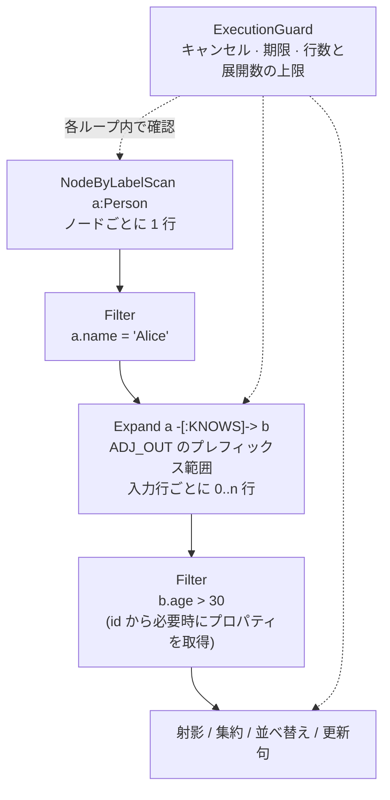

# 実行エンジン

実行エンジンは、論理実行計画を評価して結果行を生成します。中心となるのは
`marsdb-query/src/executor.rs` で、算術演算、スカラー関数、時間関数、値の
比較を扱う 4 つの補助モジュールが付随します。射影、集約、並べ替え、更新句、
実行量の制限など、論理実行計画だけでは完結しない処理もここで行います。
MarsDB の中で最も大きなコンポーネントですが、複雑なアルゴリズムを使うから
ではなく、Cypher の細かな意味規則の大半を実装しているためです。

## 行と変数の束縛

処理の単位は `BindingRow` です。これは変数名から `Binding` へのマップで、
各変数にはノード参照、エッジ参照、計算結果、リスト、パスのいずれかが
束縛されます。演算子は複数の行を受け取り、複数の行を返します。走査演算子は
ノードごとに 1 行を生成し、`Expand` は入力行ごとに 0 行以上を生成し、
`Filter` は条件を満たさない行を取り除きます。

ノードとエッジは、実体化したレコードではなく id のまま演算子間を流れます。
プロパティが必要になった時点で、第 3 章の単一プロパティ読み取り処理を使って
取得します。この処理が頻繁に呼ばれるため、その性能がクエリ全体に大きく
影響します。

ユーザーの Cypher からは見えない、内部用の束縛キーが 2 つあります。ひとつは
`OPTIONAL MATCH` の結果行と、その評価を開始した外側の行を対応づけます。これに
より、一件も一致しなかった外側の行だけを正しく `Null` で補えます。もうひとつは、
`MERGE` の行が作成処理と一致処理のどちらから来たかを記録します。`ON CREATE SET`
と `ON MATCH SET` はこの情報を使って分岐し、キーは結果を返す前に削除されます。

## 実行計画の評価

実行計画は再帰的に評価されます。走査演算子は `NODES`、ラベルインデックス、
またはプロパティインデックスを読み取ります。`Expand` は、入力行に束縛された
ノードを起点として、`ADJ_OUT` または `ADJ_IN` のプレフィックス範囲を走査
します。無向のホップでは両方を走査し、エッジ id で重複を除きます。範囲の
計算には第 3 章で説明した関数を使います。

`VarExpand` は入力行ごとに深さを制限した幅優先探索（BFS）を行います。
同じパターン内ですでに使用したエッジの集合をホップ間で引き継ぎ、ひとつの
パターンで同じエッジを繰り返し使わないという Cypher の規則を守ります。

`OPTIONAL MATCH` では、対応する実行計画の部分木を左外部結合として評価します。
一致した外側の行は、その結果をそのまま保持します。一件も一致しなかった場合は、
オプションパターンによって新たに束縛されるはずだった変数だけを `Null` で
補います。すでに束縛されていた変数は変更しません。したがって、`a` が束縛済みの
`OPTIONAL MATCH (a)-[r]->(b)` は、「この `a` から展開する。一致しなければ
`r` と `b` を `Null` にする」という意味になります。

## 実行量の制限

長時間処理を行うループでは `ExecutionGuard` を定期的に確認します。
`ExecutionGuard` は、呼び出し側が `ExecutionOptions` で指定した次の制限を
協調的に適用します。

- **キャンセル** — atomic bool を使った複製可能なトークンです。別スレッドから
  状態を変更でき、実行側はループ内の確認箇所でキャンセルを検出します。
- **タイムアウト** — 実行開始時に期限を一度だけ計算し、同じ確認箇所で現在時刻と
  比較します。
- **行数と展開数の上限** — 中間行数、結果行数、調べた隣接エントリ数を数えます。

重要なのは、結果をすべて実体化した後ではなく、実行計画の評価中に制限を確認
することです。`MATCH (a)-->(b)-->(c)` の中間結果が急増した場合も、上限を
超えた時点で停止します。無制限にメモリを消費してから結果を切り詰めることは
ありません。

プリエンプションや監視用のスレッドは使いません。他のコンポーネントと同じく、
バックグラウンドスレッドを持たない設計です。このため、停止できる粒度は
`ExecutionGuard` を確認する間隔によって決まります。

`ExecutionGuard` は、削除済みエッジの id と型名の対応も保持します。Cypher では、
同じ文の前半で `DELETE r` を実行した後でも `type(r)` を評価できます。エッジの
型は作成後に変わらないため、元のレコードが残っている必要はありません。一方、
削除済みエッジのプロパティを読むとエラーになります。削除処理は、レコードを
消す直前に型名を記録します。`type()` は通常の検索に失敗した場合に限り、この
記録を参照します。この挙動は適合性テストから判明したもので、コードコメントに
該当するテストシナリオを記載しています。

## 式と 3 値論理

述語と射影の評価には、SQL と同様の 3 値論理を使います。`null` を含む比較の
結果は unknown になり、`AND` と `OR` は 3 値論理の真理値表に従います。
`WHERE` が残すのは、述語が明確に true となる行だけです。第 6 章で説明した
ように、unknown を false に変えてから `NOT` を適用すると誤って true に
なります。この規則をすべての演算子で統一するため、値の比較処理を共通の
モジュールに集約しています。

値は動的に型付けされます。第 5 章の意味検証で確認するのは、ノード、エッジ、
スカラーといった構造上の種別だけです。実際の値の型が合わない場合は、実行時
エラーになります。異なる型同士の比較は Cypher の仕様に従って false になり、
不正な型に対する算術演算は `QueryError::Type` を返します。

## 集約

Cypher には `GROUP BY` 句がありません。集約を含む `RETURN` または `WITH` では、
集約関数を使っていない項目がグループ化キーになります。実行エンジンはそれらの
値をキーとして行をグループ化し、グループごと、集約項目ごとにアキュムレータを
ひとつ用意します。対応する集約は `count`、`sum`、`avg`、`min`、`max`、
`collect` です。`DISTINCT` を指定した場合は、アキュムレータごとに既出値も
記録します。

グループ化キーにはハッシュ可能な型が必要ですが、MarsDB の値型には `f64` が
含まれるため、`Eq` と `Hash` を derive できません。IEEE 浮動小数点数では
反射律を満たす等価関係が定義できないためです。そこで、浮動小数点数をビット列
としてハッシュする専用の `HashKey` 型を使います。

通常の浮動小数点数では、等しい値のビット列も等しいため問題ありません。
境界的なケースでは、`NaN` 同士を同じグループとして扱い、`+0.0` と `-0.0` は
別のグループになります。ノードとエッジは、他の等価比較と同じく id でハッシュ
します。`DISTINCT` の既出値集合にも同じ `HashKey` を使います。

## 2 つの出力方式

標準の実行方式では、結果全体を `QueryResult` として実体化します。
`QueryResult` には列名、値の行、文ごとの更新件数が含まれます。`ORDER BY`、
`SKIP`、`LIMIT`、`DISTINCT` は射影後の列に対してこの段階で適用されます。
したがって、`ORDER BY` では射影で付けた別名も参照できます。

`execute_streaming_with_options` は、呼び出し側が渡した sink に 1 行ずつ結果を
渡します。結果件数にかかわらず、メモリ使用量を一定に保てます。ただし対象は、
実体化せずに処理できる単純な `MATCH ... RETURN` に限られます。`SKIP` と
`LIMIT` は使用できますが、`ORDER BY`、集約、`DISTINCT`、`WITH` を含む
クエリはエラーになります。これらの処理は結果を出す前に全行を確認する必要が
あり、一定量のメモリで処理するという API の契約を満たせないためです。
sink が「停止」を返した場合は、走査もそこで終了します。

`CREATE`、`MERGE`、`SET`、`DELETE`、`REMOVE` などの更新句も、同じ行の流れに
対して適用されます。パターンから得た各行について、第 4 章の `_in_txn` 層を
通じて更新を行います。すべての更新は文に対応するひとつのトランザクション内で
実行され、件数は `QueryStats` に記録されます。

次章では、完成した結果をプロセスの外へ渡す方法を説明します。行を C ABI の
境界を越えて渡し、Arrow のレコードバッチ、Python オブジェクト、Go のマップへ
変換するまでを扱います。
