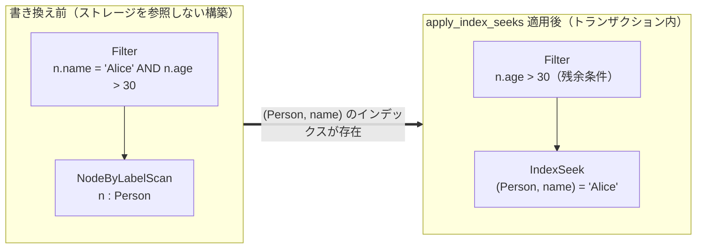

# 中間表現とプランナ

`MATCH` のパターンは、`ir.rs` で定義する論理演算子の木へ変換されます。
プランナ（`planner.rs`）は、ストレージの統計を参照してその木を書き換えます。
重要な書き換えの多くがプロパティインデックスを利用するため、この章では
`marsdb-graph/src/index.rs` のインデックス実装も扱います。

## 論理演算子

`LogicalPlan` には 9 種類の演算子があります。初期行を生成する葉演算子は
次の 4 種類です。

- `AllNodesScan` — すべてのノードを走査します。
- `NodeByLabelScan` — ラベルインデックスを使い、指定したラベルの全ノードを
  走査します。
- `IndexSeek` / `IndexRangeSeek` — 指定したラベルを持ち、インデックス対象の
  プロパティが値と等しい、または指定範囲に含まれるノードを取得します。
- `Seed` — ストレージを読みません。`WITH` の後など、文の前段ですでに変数を
  束縛した行から処理を開始します。

`EdgeTypeScan` は、葉演算子と 1 ホップの処理を兼ねます。`EDGES` テーブルを
順に走査し、単一ホップのパターン全体を一度に束縛します。適用条件は後述します。

残りは入力行を変換する演算子です。`Expand` は隣接情報を使った固定長の 1 ホップ、
`VarExpand` は `[:TYPE*1..3]` のような範囲を持つ幅優先探索、`Filter` は
束縛済みの行に対する述語を表します。

演算子の木は、Cypher の句をそのまま並べたものではありません。走査の上に展開、
その上にフィルタを組み合わせ、グラフのアクセス方法を表します。この構造により、
`Filter` と `NodeByLabelScan` の組を `IndexSeek` へ局所的に置き換えても、
上位の演算子を変更せずに済みます。

## 実行計画を作る 2 つのフェーズ

実行計画は、ストレージを使わない構築フェーズと、ストレージを参照する書き換え
フェーズに分かれます。

`build_match_plan` はストレージへアクセスしません。開始変数がすでに束縛されて
いれば `Seed`、そうでなければ走査演算子を選びます。各ホップに `Expand` を追加し、
パターン内のプロパティと追加ラベルからフィルタを作り、残りの `WHERE` 条件を
結果の上に配置します。この段階ではインデックスの有無が分からないため、
`IndexSeek` は生成しません。

次に、文のトランザクション内で `apply_index_seeks` と開始点選択を実行します。
この時点では `Txn` があり、`(Person, name)` にインデックスが存在するかを同じ
スナップショット上で確認できます。ストレージに依存する判断を実行対象の
スナップショット内で行う一方、最初の構築処理はデータベースなしでユニットテスト
できます。

構築中には Cypher のパターン規則も適用します。ひとつのパターン内で複数のホップが
同じリレーションシップを使うことはできません。各ホップへ、それ以前に使った
リレーションシップ変数の集合を渡します。`VarExpand` の幅優先探索にも同じ除外集合を
渡します。

`MATCH (n)-[r]->(n)` のように同じ変数が再登場した場合、両端は同じノードでなければ
なりません。再登場した変数には内部用の新しい名前を付け、`VarEq` フィルタを追加して、
同一性の制約を通常の述語として評価します。

## 述語のプッシュダウン

`build_match_plan` は最初、`WHERE` 全体をひとつの `Filter` としてパターンの上に
置きます。複数ホップのパターンで `start.prop = 'x'` がすべての `Expand` より
上にあると、走査演算子の直上だけを調べるインデックス書き換えから条件が見えません。

そこで、述語を最上位の `AND` ごとに分解し、開始変数だけに依存すると証明できる
条件を、開始ノードの葉演算子の直上へ移動します。`conjunct_sole_var` が認識するのは、
参照変数が明確な単純な式だけです。判断できない式は元の位置に残します。安全性を
証明できないプッシュダウンは結果を変える可能性がありますが、適用しなければ性能上の
最適化を逃すだけです。すべての書き換えで、結果が変わらないことを条件にしています。

## プロパティインデックスと検索演算子への書き換え

プロパティインデックスは `(label, property)` ごとに宣言し、必要に応じてユニーク
制約を付けます。エントリは共有の `PROPERTY_INDEX` テーブルへ次のキーで保存します。

```text
label_id ++ prop_id ++ encoded_value
```

値には、同じ型の中でバイト列の辞書順と値の順序が一致するエンコーディングを使います。
符号付き整数では符号ビットを反転し、2 の補数の順序を符号なし big-endian の順序へ
変換します。浮動小数点数では、非負値の符号ビットを反転し、負値の全ビットを反転します。
文字列は UTF-8 のコードポイント順です。ICU の照合順序は使いません。先頭の型タグに
よって、異なる型の値が混在しないようにします。

この形式により、`WHERE n.year > 2000` を連続したキー範囲へ変換できます。
`IndexRangeSeek` はインデックス全体ではなく、その範囲だけを走査します。



`apply_index_seeks` は、`NodeByLabelScan(n, Label)` の直上にある
`Filter(n.prop = literal)` を調べます。`INDEX_DEFS` に対応する宣言があれば、
`IndexSeek` へ置き換えます。第 5 章で AST が `Compare(prop, op, literal)` を
専用の形式として保持したため、この判定は構造のパターンマッチで行えます。

検索に使った条件を取り除き、残りの条件から `Filter` を作り直して `IndexSeek` の
上に置きます。範囲条件も同様に `IndexRangeSeek` へ変換します。ただし数値の範囲検索は、
整数と浮動小数点数の両領域を調べ、精度を失う変換では境界を外側へ広げるため、候補を
多めに返します。元の条件を残余 `Filter` として必ず再評価し、最終結果の正しさを
保証します。

## 開始点の選択

`MATCH (a:Common)-->(b:Rare {id: 1})` を左から評価すると、すべての `Common`
ノードから展開します。インデックスで 1 件に絞れる `Rare` ノードから入方向の隣接情報を
調べれば、処理件数を減らせる場合があります。`ADJ_IN` と `ADJ_OUT` は対になっているため、
どちらから始めても結果は同じです。プランナはコストだけを比較して開始点を選びます。

`plan_reversed_pattern` は、ラベルごとのノード数、総ノード数、型ごとのエッジ数という
O(1) で得られる統計から両方向のコストを見積もります。

```text
cost(anchor A, other B) = rows_A · (1 + filtered_A)
                        + E_A    · (1 + filtered_B)
E_A = E · rows_A / label_rows_A
```

最初の項は、開始側の推定行数と、各行に対するフィルタ評価を表します。次の項は、
開始側から調べるエッジ数と、各エッジに対する反対側のフィルタ評価です。インデックスで
ラベル内の候補が絞られた割合を使い、次数が一様だと仮定して型全体のエッジ数を按分します。

行の走査、フィルタ評価、エッジの探索には同じ重みを使います。実データで後者 2 つを
測ると、1 件あたり約 0.66 µs と 0.65 µs で同じ桁だったためです。`filtered` は、
プッシュダウンできてもインデックスを使えない `CONTAINS`、範囲条件、`$param` との
比較などを表します。実行計画の作成時には選択率が分からないため、推測値は置きません。

このモデルの導入に使ったベンチマークは、9,125 件の映画をタイトルの `CONTAINS` で
絞り、671 件のユーザーとの間にある 10 万エッジを探索します。記述順の見積もりは
118,000 作業単位、反転時は 200,000 作業単位となり、記述順が実測で 9 倍速いという
結果と同じ選択になりました。

反転するのは、反対側から始める見積もりが明確に小さい場合だけです。同値なら結果を
決定的にするため記述順を保ちます。可変長ホップ、名前付きパス、`shortestPath` を含む
パターンでは反転しません。これらは探索順序がユーザーから観測でき、開始点の変更によって
結果の順序が変わる可能性があるためです。

## 第 3 の方法: エッジテーブルの逐次走査

`MATCH (a)-[r:RATED]->(b) WHERE r.rating < 2 DELETE r` のような一括処理では、
どちらのノードから始めても多数の隣接エントリを調べ、エッジごとに点検索が発生します。
`plan_edge_scan` は第 3 の候補として、`EDGES` テーブルの逐次走査を見積もります。
各レコードのバイト列からリレーションシップの述語を直接評価し、隣接テーブルもエッジ
ごとの点検索も使いません。

キャッシュが温まった状態で 166,000 件のエッジを走査し、レコードごとの述語デコードも
含めて約 5〜6 ms でした。同じエッジを隣接情報から 1 件ずつ取得すると約 110 ms でした。

この方法を適用する条件は限定しています。固定長の 1 ホップ、記述方向が明確、3 変数が
すべて未束縛、各端点のラベルは最大 1 個、リレーションシップ変数に対してレコードの
バイト列だけで true または false を確定できる条件が 1 個以上あることが必要です。

3 値論理にも注意が必要です。`NOT` の内側として認めるのは `IS NULL` だけです。
unknown を false として処理した比較を否定すると true になり、Cypher の意味と異なる
ためです。コスト判定では O(1) で取得できるエッジ数と、最良の開始点を使う見積もりを
比較します。逐次走査だけでは判定できない条件は、上位の残余 `Filter` で評価します。

## `EXPLAIN`

`EXPLAIN <statement>` は、通常の実行と同じくフロントエンドと 2 段階の実行計画作成を
行い、演算子の木を表示します。トランザクション内で処理するため、インデックスの確認と
統計値も実行時と同じスナップショットを使います。`IndexSeek` が選ばれたか、どの条件が
残余 `Filter` として残ったかを確認できます。

`UNWIND`、`WITH`、`CREATE` のように `LogicalPlan` を作らない行操作は、1 行のラベルで
表示します。`MERGE` のマッチ部分は入力行の束縛に依存するため、同様に個別の木としては
表示しません。ただし変数のスコープは引き継ぐので、それらの後にある `MATCH` では
`Seed` と走査演算子のどちらが選ばれるかを正しく表示できます。

次章では、実行エンジンがこの演算子の木を評価する方法を説明します。
