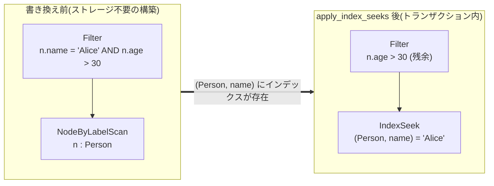

# IR とプランナ

`MATCH` パターンは論理演算子の小さなツリー(`ir.rs`)にコンパイル
され、プランナ(`planner.rs`)がそれをストレージ統計を見ながら
書き換えます。この章はプロパティインデックスそのもの
(`marsdb-graph/src/index.rs`)も扱います。プランナの最重要の
書き換えは、それを活用するために存在するからです。

## 演算子の品揃え

`LogicalPlan` には 9 つの演算子があります。4 つは葉 — 最初の行を
生み出す方法です:

- `AllNodesScan` — すべてのノード。
- `NodeByLabelScan` — ラベルインデックス経由で、あるラベルを持つ
  すべてのノード。
- `IndexSeek` / `IndexRangeSeek` — インデックス付きプロパティが値に
  等しい、または有界レンジに入る、`label` のノード。
- `Seed` — ストレージには一切触れない: 文の前の部分で既に束縛された
  行から始める(`WITH` 継続の場合)。

1 つは葉とホップの複合です: `EdgeTypeScan`。`EDGES` テーブル全体の
逐次スキャンで、単一ホップパターン全体を一度に束縛します — 詳細は
後述。残りは行を変換します: `Expand`(隣接を通る固定 1 ホップ)、
`VarExpand`(`[:TYPE*1..3]`、入力行ごとの有界 BFS)、`Filter`
(束縛済み行への述語)。

ツリーの形が意図的に Gremlin 風 — スキャンが展開に、展開がフィルタに
流れ込む — であって Cypher の形でないことの利得は、「どのアクセス
パスか」が局所的な置換になることです: `IndexSeek` は、その上の何も
気づくことなく `Filter`-over-`NodeByLabelScan` を置き換えられます。

## 実行計画の構築とストレージ参照

実行計画は、明確に分かれた 2 つのフェーズで作成されます。

`build_match_plan` はストレージアクセスなしで走ります。開始変数の葉
(変数が束縛済みなら `Seed`、さもなくばスキャン)を選び、ホップごとに
`Expand` を連ね、インラインのパターンプロパティと追加ラベルから
フィルタを合成し、残った `WHERE` の連言を結果に巻きつけます。どの
インデックスが存在するか知り得ないので、`IndexSeek` は決して出力
しません。

次に、文のトランザクションの中 — `Txn` が存在し、
「`(Person, name)` にインデックスはあるか」に確定した答えがある
場所 — で書き換えパスが走ります: `apply_index_seeks` と開始点戦略
です。この分割は、ストレージ依存のすべての判断を、それが実行される
スナップショットの中に保ち、純粋な部分をデータベースなしで単体
テスト可能にします。

パターンの意味論は構築中に強制され、2 つの簿記集合は、間違えやすい
実際の Cypher ルールを符号化しているので言及に値します。
*エッジ同型性*: 1 つのパターンは 2 つのホップを同じリレーション
シップ実体に束縛してはなりません — プランナは先行ホップの
リレーションシップ変数の集合を後続の各ホップへ(そして `VarExpand`
の BFS の除外集合へ)通すので、ホップはパターンが既に使ったエッジを
歩いて戻れません。*束縛済み変数の再登場*: `MATCH (n)-[r]->(n)` は
両端点に `n` を再利用し、それは「同じノード」を意味せねばなりません —
再登場した変数は新しい内部名と合成された `VarEq` フィルタを与えられ、
同一性制約が普通の述語機構になります。

## 述語プッシュダウン

`build_match_plan` は最初、パターン全体を `WHERE` 句を持つ 1 つの
`Filter` で包みます。そのままだと、複数ホップパターンの
`start.prop = 'x'` のような連言はすべての `Expand` の*上*に座り、
インデックス書き換え — `Filter` の直下だけを検査する — が置き換える
べきスキャンに決して届きません。そこでビルダは述語をトップレベルの
`AND` 連言に分解し、開始変数だけに依存すると証明できる各連言を
開始ノードの葉を直接包むよう押し下げます。

適格性検査(`conjunct_sole_var`)は意図的に狭い: 変数参照が明白な
単純い葉の形だけを認識し、認識できないものは元の場所に留まります。
推測するプッシュダウンは結果を変え得ますが、辞退するプッシュダウンは
最適化を逃すだけです。同じ保守性がプランナ全体で繰り返され、名前を
与える価値のある立場です: **すべての書き換えは答えを保存すると証明
可能でなければならず、安全性を証明できない場合は実行計画を書き換えない。**

## プロパティインデックスとシーク書き換え

プロパティインデックスは `(label, property)` 対ごとに、任意で unique
として宣言されます。エントリは共有の `PROPERTY_INDEX` テーブルに
`label_id ++ prop_id ++ encoded_value` キーで住み、値の
エンコーディングにこそ面白いエンジニアリングがあります:
**順序保存バイトエンコーディング** — 辞書式バイト比較が同一型内の
実際の値順序と等しくなるように。符号付き整数は標準の符号ビット反転
(2 の補数の順序を符号なしビッグエンディアンのバイト順に写す)、
浮動小数は sortable-float 変換(非負は符号ビットを反転、負は全ビットを
反転)、文字列は生の UTF-8(コードポイント順 — ICU 照合なしで
「十分に近い」値を使うという、多くの組み込みデータベースと同じトレードオフ）、
先頭の型タグが異なる型の混在を防ぎます。これが `IndexRangeSeek` を
全インデックス走査ではなく連続キーレンジのスキャンにするものです:
`WHERE n.year > 2000` はバイト境界になります。



`apply_index_seeks` は、`INDEX_DEFS` がインデックスの存在を告げる
とき、`NodeByLabelScan(n, Label)` 上の `Filter(n.prop = literal)` を
`IndexSeek` に書き換えます — 第 5 章の AST の狭い
`Compare(prop, op, literal)` 形が効いてくるのはここです: 書き換えは
ちょうどその形へのパターンマッチです。消費された連言は取り除かれ、
述語の*残り*はシークの上に再構築されます。レンジ述語も同様に
`IndexRangeSeek` へ書き換えられますが、守るべき条件が 1 つあります。
数値境界に対するストレージ検索は*上位集合*を返す(int と float の
両方の型領域、損失のある変換は外側へ広げる)ので、元の連言は常に
残余 `Filter` として生き残ります — シークは候補を狭め、フィルタが
真実の源であり続けます。

## どこから始めるかを選ぶ

`MATCH (a:Common)-->(b:Rare {id: 1})` のようなパターンを左から右へ
コンパイルすると、すべての `Common` ノードをスキャンして展開します —
インデックスされた唯一の `Rare` ノードから始めて隣接を*逆向き*に
歩けば、一致する行だけに触れるのに。`ADJ_IN` は `ADJ_OUT` の鏡像
なので、実行計画は方向について対称です。どちらの端点を起点にしても結果は同じで、
純粋なコスト選択です。

`plan_reversed_pattern` は両方のアンカーを、O(1) 統計 — ラベル数、
総ノード数、書き込みパスが維持する型ごとのエッジ数 — だけで組み立てた
両方の開始点についてコストを見積もります。

```text
cost(anchor A, other B) = rows_A · (1 + filtered_A)
                        + E_A    · (1 + filtered_B)
E_A = E · rows_A / label_rows_A
```

各項はトラバーサルの現実の作業項目です: アンカーの推定行数を
スキャンし、アンカー自身の押し下げ済みフィルタを行ごとに評価し、
ホップのエッジのうちアンカーの取り分(型の総数を、インデックスが
アンカーのラベルをどれだけ狭めたかで按分 — 一様次数の仮定)を歩き、
向こう側端点の取り残されたフィルタを歩いたエッジごとに評価する。
行スキャン、フィルタ評価、エッジウォークは等しく重みづけられます —
仮定ではなく、スキャン以外の 2 つの半分が実データセットで項目あたり
約 0.66 µs と約 0.65 µs — 同じオーダー — と計測されたからで、単位
重みは同じにしています。`filtered` フラグは、押し下げ可能でもインデックスがない
述語(`CONTAINS`、レンジ、`$param` 等式)の作業に信用を与えます。
その選択率は実行計画の作成時には分からないため、推測値を置きません。モデルを
動機づけたベンチマーク形状 — タイトルの `CONTAINS` で絞られる 9,125
本の映画対 671 人のユーザ、100k エッジ — では、見積もりは記述順を
記述順を 118,000 作業単位、反転を 200,000 作業単位と見積もり、記述順が実測で 9 倍速い実行
です。

反転するのは、反対側の端点から始めるコストが明確に低い場合だけです。
同点は記述順を保ちます — 決定性のため、そして反転は推論がただでは
ないからです。さらにこのパスは、可変長ホップ、名前付きパス、
`shortestPath` を含むパターンでは自ら全面的に不適格になります —
それらはトラバーサルの*順序*をユーザに露出し、観測可能な順序を
変える書き換えは答えを保存しません。

## 第 3 の戦略: エッジを一括で掃く

どちらのアンカーでも負ける単一ホップ形があります — `MATCH
(a)-[r:RATED]->(b) WHERE r.rating < 2 DELETE r` のようなバルク操作
です。ノード側のどのアンカーも、エッジごとのストレージ取得を伴う
巨大な隣接を歩くことになります。`plan_edge_scan` は第 3 の選択肢を
コストを見積もります。`EDGES` テーブルを 1 回逐次走査することで、リレーション
シップ述語を掃いた各レコードのバイトから直接評価する — 隣接なし、
エッジごとの点取得なし。逐次対ランダムが話のすべてです: ウォームな
166k エッジレコードの逐次スキャンは、レコードごとの述語デコード込みで
約 5–6 ms。同じエッジをエッジごとの隣接取得で通すと約 110 ms でした。

適格性はプランナの保守性の最も明示的な形です: ちょうど 1 つの固定
ホップ、記述された方向、3 変数すべてが新規、端点ごとに最大 1 ラベル、
そしてスキャンが生バイトから*確定した*答えを出せるリレーションシップ
変数上の連言が少なくとも 1 つ。最後の条項には 3 値論理の機微が
あります: `NOT` は `IS NULL` の上でだけ許されます。unknown を false に
潰した比較を否定すると unknown が true に反転してしまい、それは
Cypher が禁じるからです。コストゲートは O(1) のエッジ数を最良の
アンカー見積もりと比較し、スキャンが決められないものはすべて上の
残余 `Filter` に残ります。

## EXPLAIN

`EXPLAIN <statement>` はフロントエンドと実行計画作成の両フェーズを —
実トランザクションの中で、つまりインデックス検査と統計が実行と
正確に同じに振る舞う状態で — 走らせ、実行する代わりに演算子ツリーを
表示します。利得は `IndexSeek` が発火したか、どの残余 `Filter` が
生き残ったかが見えることです。`LogicalPlan` にコンパイルされない句
種別(`UNWIND`、`WITH`、`CREATE` — トラバーサルの形を持たない行
操作、そして `MERGE` — マッチ部分の実行計画は各行の束縛に
依存)は 1 行のラベルを表示し、束縛スコープはそれらを正しく通って
糸を張られるので、その後の `MATCH` は正しい `Seed` 対スキャンの
選択で説明されます。

次章はエグゼキュータです: このツリーが走るとき実際に何が起こるか。
