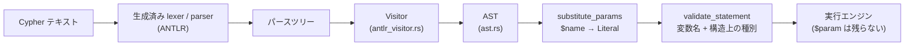

# クエリフロントエンド

クエリフロントエンドは、Cypher の文字列を検証済みの抽象構文木（AST）へ
変換します。`marsdb-query` の上位層にあり、次の要素で構成されています。

- ANTLR 文法: `grammar/CypherLexer.g4` と `grammar/CypherParser.g4`
- 生成済みのパーサ: `src/generated/`
- AST を構築する visitor: `antlr_visitor.rs`
- パラメータ置換: `params.rs`
- 意味検証: `semantic.rs`

公開 API は、1 文を解析する `parse`、セミコロン区切りのスクリプトを解析する
`parse_many`、パラメータを置換する `substitute_params` の 3 関数です。



## 文法とパースツリー

文法は openCypher の対応範囲を手作業で定義したもので、一般的な ANTLR
プロジェクトと同様に lexer と parser のファイルへ分かれています。ANTLR が
Rust の lexer と parser を生成し、その生成物もリポジトリにコミットしています。
そのため、MarsDB のビルドに Java のツールチェーンは必要ありません。

AST の構築には、ANTLR が生成する visitor トレイトを使います。パースツリーの
アクセサをすべて手作業でたどる方式に比べ、選択肢の多い文法規則を簡潔に扱えます。
たとえば、次の規則を考えます。

```text
literal : boolLit | numLit | NULL | stringLit | listLit | mapLit
```

アクセサを直接使う場合は、規則を参照するたびに `boolLit`、`numLit` などの
有無を順番に調べる必要があります。visitor では、実際に現れた選択肢に対応する
`visit_X` メソッドが自動的に呼ばれます。

生成される visitor トレイトでは、ツリー全体で戻り値の型をひとつに統一する
必要があります。このため、すべての visit メソッドが共通の `AstNode` enum を
返し、AST のノード種別ごとに variant を用意しています。

## 実行計画の作成を支える AST

`ast.rs` の `Expr` は、意味が異なる式を区別するだけでなく、後段のプランナが
利用できる情報も型として保持します。比較式は次のように分かれています。

- `Compare(prop, op, literal)` — プロパティと定数の比較です。この形式だけが、
  後でインデックス検索へ置き換えられます。
- `PropCompare(prop, op, prop)` — 2 つのプロパティの比較です。検索キーとなる
  定数がないため、インデックス検索にはならず、走査後のフィルタとして評価します。
- `GeneralCompare(expr, op, expr)` — 関数呼び出し、算術式、変数そのものなど、
  より一般的な比較です。射影式と同じ仕組みで評価し、インデックス検索には
  使用しません。
- `VarEq(a, b)` — ノードまたはリレーションシップの同一性を比較します。
  プロパティ値の比較とは異なります。`MATCH (a) ... OPTIONAL MATCH
  (b)-[:KNOWS]-(a)` のように、パターン内で束縛済みの変数が再登場した場合にも
  プランナがこの式を生成します。2 つ目の `a` が同じノードを指すという制約は、
  `VarEq` として実行計画に保持されます。
- `HasLabel(var, label)` — 複数ラベルを指定したパターンの、2 つ目以降のラベルを
  検査します。たとえば `(n:Post:Message)` では、走査演算子が一方のラベルを
  使い、フィルタが残りを確認します。`WHERE n:Post` のようにユーザーが直接
  記述する場合もあります。

すべてを汎用的な `Compare(expr, op, expr)` にまとめれば、AST の型は少なく
できます。しかしその場合、プランナは解析時には判明していた違いを、AST の
構造から判定し直さなければなりません。用途を限定した式を専用の variant として
残すことで、インデックス検索への変換を単純なパターンマッチで実装できます。

構文糖の展開もこの段階で行います。後段で扱う形式を増やさないよう、既存の式を
組み合わせた形へ変換します。`IS NOT NULL` は `Not(IsNull(..))`、
`WHERE a:A:B` は複数の `HasLabel` を結ぶ `And`、`a <> b` は
`Not(VarEq(a, b))` になります。

## パラメータは AST 上で置換する

`substitute_params` は AST を再帰的に処理し、すべての
`Literal::Param(name)` を呼び出し側が渡した具体的なリテラルへ置き換えます。
これは実行前に行われ、クエリ文字列を連結したり書き換えたりしません。

AST 上で置換するため、パラメータの値がクエリの構造を変えることはありません。
値は、すでに解析済みのツリーにあるリテラルノードになります。別の演算子や句として
解釈される文字列上の余地がないため、パラメータを通じたインジェクションを構造上
防止できます。

また、置換後の AST にはパラメータが残りません。値が渡されていない `$name` は
この段階でエラーになるため、実行エンジンは `Literal::Param` を処理する必要が
ありません。実行エンジン側では、この variant を `unreachable!` として扱います。

この方式では、式を格納できる AST 上のすべての位置を置換処理が訪れる必要が
あります。新しい句やフィールドを AST に追加した場合は、この処理も更新します。
`Statement` を網羅的に match しているため、variant を追加したのに処理を更新
しなければコンパイルエラーになります。

## 実行前の意味検証

`validate_statement` はパラメータ置換の後、ストレージトランザクションを開く
前に実行されます。データを読まなくても文だけから判断できる、次の条件を検査します。

- **変数の束縛** — 参照する変数は、使用前にパターンまたは射影によって束縛
  されている必要があります。`WITH` を越えると、その出力だけが次のスコープへ
  引き継がれます。`UNION` の各ブランチは独立したスコープを持ちます。
- **構造上の種別** — node、relationship、scalar、要素種別付き list、map、
  path、unknown という小さな型階層を式に沿って伝播させます。たとえば
  `MATCH (n)-[r]->() RETURN r.prop + n` は、走査中ではなく実行前にエラーに
  なります。

一方、プロパティ値の具体的な型は実行時に検査します。Cypher のプロパティは
動的に型付けされており、同じ `n.age` があるノードでは整数、別のノードでは
文字列になる可能性があるためです。

`COMMIT` が現在のセッションで有効かどうかも、静的な文の性質ではありません。
これはセッション状態を持つ `Database` 層で検査します。また、`UNION` の列が
互換であるかを判断するには、各ブランチを評価して得られる実際の列一覧が必要です。
その検査だけは実行エンジンが担当します。

意味検証はすべての実行前に必ず行われます。ストレージへアクセスせずに完結する
ため、文面だけで不正と判断できるクエリのためにトランザクションを開くことは
ありません。

## 文とスクリプト

`parse_many` と `split_statements` は、セミコロンで区切られたスクリプトを
処理します。文字列リテラル内のセミコロンは区切りとして扱いません。どの文も
実行していない段階で、スクリプト全体を解析します。実行時のトランザクションの
扱いは第 1 章で説明しました。

`EXPLAIN` は文法上、任意の文を包み、`Statement::Explain(inner)` を生成します。
フロントエンドは `inner` を通常どおり検証します。実行エンジンは文を実行せず、
作成した実行計画を表示します。実行計画の作成と表示形式は第 6 章で扱います。
