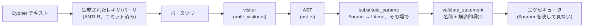

# クエリフロントエンド

Cypher のテキストを、検証済みで実行可能な AST に変換する処理は、
`marsdb-query` のフロントエンドにまとまっています。ANTLR 文法
（`grammar/CypherLexer.g4` と `grammar/CypherParser.g4`）、生成済み
パーサ（`src/generated/`）、AST を構築する visitor
（`antlr_visitor.rs`）、パラメータ置換（`params.rs`）、意味検証
（`semantic.rs`）です。公開 API は、1 文を解析する `parse`、セミコロン
区切りのスクリプトを解析する `parse_many`、パラメータを置換する
`substitute_params` の 3 関数です。

## 文法とパースツリー

文法は手で維持される openCypher サブセットで、慣例どおりレキサと
パーサのファイルに分かれ、ANTLR が Rust のレキサ/パーサ対に
コンパイルします。生成は事前に行われコミットされています — MarsDB の
ビルドに Java ツールチェーンは要りません。

AST ビルダは、パースツリーのアクセサを手で歩く代わりに、ANTLR が
生成した visitor トレイトを実装します。違いは選択肢の多い文法で
効いてきます: `literal : boolLit | numLit | NULL | stringLit |
listLit | mapLit` のような規則は、さもなくば使用箇所ごとに手書きの
`if let Some(x) = ctx.boolLit() ... else if ...` 連鎖を必要とします
が、visitor の二重ディスパッチは実際に存在する選択肢に対応する
`visit_X` メソッドへ自動で経路を通します。生成トレイトは 1 つ注目
すべき制約を課します: ツリーウォーク*全体*で戻り値型は 1 つ。そこで
ビルダは共有の `AstNode` enum をすべての visit メソッドに通し、AST
ノード種別ごとに variant を増やしていきます。

## AST はプランナに関わる形を符号化する

`ast.rs` は設計の産物として読む価値があります。その `Expr` 型は
微妙なことをしているからです: 比較の形を、単に意味でではなく、
*プランナが後で何をできるか*で区別しています。

- `Compare(prop, op, literal)` — プロパティ対定数。この狭い形だけが
  後段のインデックスシーク書き換えの対象になります。
- `PropCompare(prop, op, prop)` — プロパティ対プロパティ。シーク
  すべき定数がないのでインデックス対象には決してならず、常に
  スキャン後のフィルタです。
- `GeneralCompare(expr, op, expr)` — それより広いすべて: 関数呼び出し、
  算術、裸の変数。射影式と同じ評価機構、同じ
  「インデックス対象には決してならない」立場です。
- `VarEq(a, b)` — ノード/リレーションシップの*同一性*比較で、
  プロパティの比較とは別物です。プランナはパターン内の束縛済み変数の
  再登場にもこれを合成します: `MATCH (a) ... OPTIONAL MATCH
  (b)-[:KNOWS]-(a)` の 2 つ目の `a` は「この同じノード」を意味せねば
  ならず、`VarEq` によってその制約が実行計画にも保持されます。
- `HasLabel(var, label)` — 複数ラベルパターンの 2 つ目以降のラベル
  (`(n:Post:Message)` — スキャンが 1 つを扱い、フィルタが残りを検査)
  のために合成され、ユーザが直接書くこともあります
  (`WHERE n:Post`)。

すべてを汎用的な `Compare(expr, op, expr)` にまとめれば、フロントエンド
自体は小さくできます。しかしその場合、プランナは、解析時には分かっていた
違いを AST の構造から判定し直さなければなりません。用途の限られた比較を
専用の型として残すことで、インデックスシークへの変換を複雑な解析ではなく、
単純なパターンマッチで実装できます。

脱糖もここで起き、常に下流の場合分けが*減る*方向です: `IS NOT NULL`
は 4 つ目の variant ではなく `Not(IsNull(..))` としてパースされ、
`WHERE a:A:B` は `HasLabel` の `And` 連鎖になり、`a <> b` は
`Not(VarEq(a, b))` になります。

## パラメータはテキストではなく構造

`substitute_params` は AST を歩き、すべての `Literal::Param(name)` を
呼び出し側のマップの具体的なリテラルにその場で置き換えます。実行前に、
文字列を操作せず AST 上で置換することには、重要な利点が 2 つあります。

第一に、インジェクションは構造上不可能です — パラメータ値は
*パース済みツリーのリテラルノード*になります。それが別の何かを意味
できる文字列文脈は、もう残っていません。

第二に、エグゼキュータはパラメータを決して見ません。置換パスは全域的
です(束縛のない `$name` はここでエラー)。だからエグゼキュータの
リテラル評価は `Literal::Param` を `unreachable!` として扱います —
不変条件は境界で強制され、以後は前提とされる。ストレージ層が自分の
不変条件にも適用している「問題を隠さず明示する」という方針です。

ウォーク自体はこの設計の機械的な代償です: すべての句のすべての式を
持つ位置を訪問せねばならず、AST に位置が増えればウォークの拡張が
要ります。安全網はコンパイラです — `Statement` 上の網羅的 match は
variant が増えたときはコンパイルエラーとなり、修正漏れを見逃しません。

## 意味検証: 実行前に文が約束できること

`validate_statement` は置換の後、そして — 意図的に — ストレージ
トランザクションが存在する前に走ります。文だけから知り得ることを
検査します:

- **名前束縛。** 参照されるすべての変数は使用前にどこかのパターンか
  射影で束縛される; `WITH` 境界はスコープを正確にその出力へリセット
  する; `UNION` の各アームは独立にスコープされる。
- **構造的種別。** 小さな束 — node、relationship、scalar、
  list-of-kind、map、path、unknown — が式を通じて伝播されるので、
  `MATCH (n)-[r]->() RETURN r.prop + n` はスキャンの途中ではなく
  今、失敗します。

検査*しない*と決めたことも同じくらい雄弁で、理由が記録されています:
プロパティ*値*の型はデータ依存であり実行時検査に残ります(Cypher は
プロパティレベルで動的型付けです — 同じ `n.age` があるノードでは整数、
次のノードでは文字列であり得ます)。`COMMIT` が*今*有効かどうかは
セッション状態であり、文の静的性質ではなく `Database` 層の管轄です。
UNION の列互換ルールは各アームの実際に評価された列リストを必要とし、
それは実行前には存在しません — だからその 1 つの検査はエグゼキュータに
住んでいます。

この検証は、すべての実行前に必ず行われます。ストレージへアクセスせずに
完結するため、文面だけで不正と判断できるクエリのためにトランザクションを
開くことはありません。これはワークスペース全体で守られる保証です。

## 文とスクリプト

`parse_many` と `split_statements` が `;` 区切りスクリプトを扱います —
文字列リテラルの外で分割し、どれかが実行される前に全文をパースします
(実行の意味論は第 1 章で扱いました)。`EXPLAIN` は文法レベルで任意の
文を包んで `Statement::Explain(inner)` を作ります — フロントエンドは
`inner` を検証することでこれを検証し、エグゼキュータはこれを捕まえて
実行の代わりに実行計画を表示します。その表示形式と実行計画を作る
プランナともども、第 6 章の主題です。
