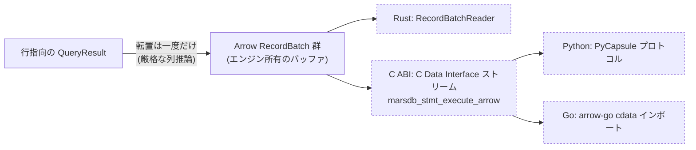

# 結果と言語境界

クエリの答えはエンジンを出ていかねばなりません — Rust の構造体へ、
C の呼び出し側へ、Python オブジェクトへ、Go のマップへ、Arrow の
コンシューマへ。この章は結果モデル
(`marsdb-query/src/{result,value}.rs`)、C ABI(`marsdb-capi`)、
Arrow エクスポート(`marsdb/src/arrow.rs`)を、それらすべてを形づくる
テーマ — あらゆる境界越えにはコストがあり、設計目標は各コストを
一度だけ払うこと — に目を置いて説明します。

## 結果モデル

`QueryResult` は列、`Value` の行、そして `QueryStats` — 文ごとの
書き込みカウンタ(作成・削除されたノードとリレーションシップ、設定
されたプロパティ、追加・除去されたラベル)です。これは「私の
`DELETE` はいくつ削除したのか」に答えます。結果の行だけでは答え
られない問いです。広いグラフデータベースエコシステムの慣例に従い、
プロパティの除去は設定として数えます(`SET n.p = null` と
`REMOVE n.p` は内部的に文字どおり同じ操作です)。

`Value` はクエリ層の値型で、保存可能な `PropertyValue` の上位集合
です: ノードとエッジそのもの、パス、そしてクエリ時にだけ存在する
リスト/マップの形を加えます。この分割は構造を支えています。パスは
交互に並ぶ単一の `node, edge, ..., node` ベクタです — ノードと
エッジの並行ベクタではありません。それはすべての構築箇所に強制され
ない長さ不変条件を作ってしまいます。マップ値は射影して返せますが
決して保存できません: 保存可能プロパティへの変換がそれを拒否し、
Cypher の「マッププロパティ禁止」ルールを、すべての書き込みパスに
任せるのではなく 1 つの関所で強制します。

## C ABI

`marsdb-capi` は `cdylib`/`staticlib` にコンパイルされ、SQLite の形の
C API を公開します: 不透明ハンドル(`MarsdbDatabase`、文、結果)、
整数ステータスコード、ハンドルごとの `last_error` 文字列。ヘッダ
`marsdb.h` が記録上のドキュメントであり、Rust ファイルの仕事は
ヘッダの約束を守ることです。unsafe コードを組織する 3 つの不変条件:

- **パニックは境界を越えない。** エンジンコードを走らせるすべての
  エントリポイントは `catch_unwind` で包みます — Rust のパニックが
  C の呼び出し側へ巻き戻るのは未定義動作なので、境界はパニックを
  エラー戻り値に変換します。
- **ハンドルには文書化された寿命がある。** 値ハンドルは結果の行を
  指し、行は構築後に決して変更されません。次の行へ進むことは契約上
  ハンドルを無効化し(SQLite の慣例)、実装の行ごとアリーナが
  その契約を安価にします。
- **エラーは push ではなく pull。** 呼び出しはステータスコードを
  返し、`marsdb_last_error` がメッセージを返します。データベース
  ハンドルのエラースロットが mutex の後ろにあるのは、ヘッダがこの
  ハンドルに単一呼び出し側の約束をしていないからです。

結果を一括取得するため、ABI には**バイナリバッチ形式**があります。
1 回の呼び出しが結果全体を、コンパクトな自己記述バッファ —
インターンされた列名とプロパティ名、varint 整数 — として返し、
バインディングが自分の言語でデコードします。値ごとではなく
言語境界を越えるのは値ごとではなく、クエリごとに 1 回だけです。
マーシャリング、エラー検査、ランタイムによってはロック取得を伴う
FFI 呼び出しのオーバーヘッドも、一度しか発生しません。
一方、ストリーミングコールバック形式なら、メモリ使用量を一定に保ったまま
件数に上限のない結果を扱えます。エグゼキュータのストリーミング処理から、
コールバック 1 回につき 1 行を渡します。

バインディングはこの上に重なります: Python バインディング
(`marsdb-python`、PyO3)はエンジンをインタプリタのプロセスに直接
リンクし、Go バインディング
([marsdb-go](https://github.com/knoguchi/marsdb-go)、独立
リポジトリ)は cgo を通じてこの C ABI を消費します。どちらも結果には
同じバッチ形式を採用し、実行制限とトランザクションについても同じ API を
公開します。

## Arrow: 列指向の境界

データフレームや列指向計算などの分析用途では、行指向の結果は扱いにくく、
値をひとつずつ変換するのも非効率です。そこで MarsDB は、
答えはコア所有の Arrow エクスポート(`Database::query_arrow`、
オプトインの `arrow` cargo feature の後ろ)です: 行から列への転置は
エンジンの中で正確に一度だけ起こり、その下流はすべてゼロコピーです:

- Rust では標準の `RecordBatchReader`。
- C を越えるときは、`marsdb-capi` がエクスポートする Arrow **C Data
  Interface** ストリーム(`marsdb_stmt_execute_arrow`)— 列バッファの
  所有権をシリアライズなしで言語境界を越えて渡す Arrow の ABI。
- Python では PyCapsule プロトコル: Arrow 対応のライブラリは
  ストリームを直接インポートします。
- Go では arrow-go の `cdata` インポートが同じストリームを包みます。

計測された効果を、Go バインディングでの 20 万行 3 列の結果から:
バッチ形式では、バインディング側でクエリあたり約 120 万回（83 MB）の
メモリ確保が発生しますが、Arrow 形式では約 900 回（83 KB）です。実行時間は
ほぼ同等です。どちらもエンジンの実行が支配的だからですが、アロケータと
GC の圧力は 3 桁減ります。列指向境界の勝ちはアロケーション
プロファイルであり、エンジン自身の時間の取り分が縮むほど大きく
なります。

列の型付けは厳格で、意図的にそうです。Cypher の列は動的型付けなので、
エクスポータは列の型を結果全体にわたって推論します — エクスポートが
最初のバッチを渡す前に実体化するのもそのためです: 推論には全行が
要ります。ルールはシステムの他の場所と同じ精度の規律を映します:
整数は正確に `Int64` としてエクスポート; 整数と浮動小数が混じる列は
`Float64` への黙った昇格(2^53 を超える整数を壊します)ではなく
**エラー**; 日付は `Date32`、duration は `Interval(MonthDayNano)`、
他の時制は正準 ISO テキスト; 同種リストは `List<child>` として
ネスト; null は Arrow の validity ビットになり、列は非 null の値で
型付けされ続けます。ノード、エッジ、マップ、パスの列は指示つきの
エラーです — スカラープロパティを射影せよ — エンティティを文字列に
平坦化すれば、分析側がそれから再パースする羽目になる構造そのものを
捨てることになるからです。

依存衛生の注記を 1 つ: このクレートは自分の arrow-rs 型を
`marsdb-capi` と `marsdb-python` が消費できるよう再エクスポート
します。下流のクレートはどれも自前の arrow-rs 依存を宣言せず、
バージョン分裂が同じ C 構造体の非互換な 2 定義を生むことはできません。

残りの章はパイプラインから一歩引きます: このシステムはどうテストされ
計測されるのか、そして計測は何を変えたのか。
