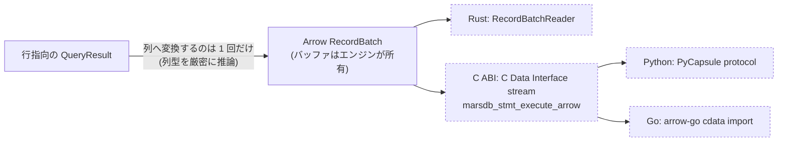

# 結果とプログラミング言語の境界

クエリ結果は実行エンジンの外へ渡され、Rust の構造体、C の呼び出し側、
Python オブジェクト、Go のマップ、Arrow 対応ソフトウェアから利用されます。
この章では、結果のデータモデル（`marsdb-query/src/{result,value}.rs`）、C ABI
（`marsdb-capi`）、Arrow エクスポート（`marsdb/src/arrow.rs`）を説明します。
言語境界を越える処理にはオーバーヘッドがあるため、同じ変換を何度も行わない
ことが設計上の要点になります。

## 結果のデータモデル

`QueryResult` は、列名、`Value` の行、`QueryStats` で構成されます。
`QueryStats` には、文の実行によって作成・削除されたノードとリレーションシップ、
設定したプロパティ、追加・削除したラベルの件数が入ります。たとえば `DELETE` が
何件を削除したかは、返された行だけでは分からないため、この統計が必要です。

他のグラフデータベースと同様に、プロパティの削除も「プロパティを設定した件数」
として数えます。内部では `SET n.p = null` と `REMOVE n.p` が同じ操作として
実装されています。

`Value` はクエリ層で使う値型であり、保存可能な `PropertyValue` に、ノード、
エッジ、パス、リスト、マップを加えたものです。リストやマップには、クエリの
評価中だけ存在し、プロパティとして保存できない形式も含まれます。

パスは、`node, edge, ..., node` の順に要素が並ぶひとつのベクタとして表します。
ノードとエッジを別々のベクタに分けると、両者の長さの関係をパスの作成箇所すべてで
保証しなければならないためです。マップは射影して結果として返せますが、プロパティ
としては保存できません。`Value` から保存可能な型へ変換する一箇所でマップを拒否し、
すべての書き込み処理に同じ検査を重複させないようにしています。

## C ABI

`marsdb-capi` は `cdylib` または `staticlib` としてビルドされ、SQLite に似た
形式の C API を提供します。`MarsdbDatabase`、statement、result などの不透明な
ハンドル、整数のステータスコード、ハンドルごとの `last_error` 文字列を使います。
公開仕様は `marsdb.h` に記載し、Rust 側の実装はその仕様に従います。

unsafe コードは、次の 3 つの規則に基づいて構成されています。

- **panic を言語境界の外へ伝播させない。** エンジンを呼ぶ各エントリポイントを
  `catch_unwind` で囲みます。Rust の panic が C の呼び出し側まで unwind すると
  未定義動作になるため、境界でエラーコードへ変換します。
- **ハンドルの有効期間を API で定める。** 値のハンドルは結果行の内部を参照します。
  結果を作成した後に行の内容は変更しません。次の行へ進むと値ハンドルが無効に
  なるという SQLite と同じ規則を採用し、行ごとの arena で実装しています。
- **エラーは呼び出し側が取得する。** 各関数はステータスコードを返し、詳細な
  メッセージは `marsdb_last_error` で取得します。同じデータベースハンドルが
  複数の呼び出し元から使われる可能性があるため、エラー格納領域は mutex で
  保護します。

結果を一括取得する API では、結果全体を自己記述型のコンパクトなバイナリとして
1 回の呼び出しで返します。列名とプロパティ名をインターンし、整数は varint で
表現します。各言語のバインディングが、このバッファを自分のデータ型へデコード
します。FFI の呼び出し、マーシャリング、エラー確認、ランタイムによってはロック
取得にかかる費用は、値ごとではなくクエリごとに 1 回だけ発生します。

ストリーミング API では、コールバック 1 回につき 1 行を渡します。実行エンジンの
ストリーミング処理をそのまま利用するため、結果件数に上限がなくてもメモリ使用量を
一定に保てます。

Python バインディング（`marsdb-python`、PyO3）は、エンジンを Python
インタプリタのプロセスへ直接リンクします。別リポジトリの Go バインディング
（[marsdb-go](https://github.com/knoguchi/marsdb-go)）は cgo から C ABI を
呼び出します。どちらも一括取得形式を使い、実行量の制限とトランザクションに
ついても同等の API を公開します。

## Arrow による列指向の受け渡し

データフレームや列指向計算では、行指向の結果を値ごとに変換すると余分な処理が
発生します。MarsDB は、`arrow` Cargo feature を有効にした場合に
`Database::query_arrow` を提供します。行から列への変換はエンジン内で一度だけ
行い、その後は同じ列バッファの所有権を受け渡します。

- Rust では標準の `RecordBatchReader` として返します。
- C ABI では `marsdb_stmt_execute_arrow` が Arrow **C Data Interface** の
  ストリームを返します。シリアライズせずに列バッファの所有権を言語境界の外へ
  渡せます。
- Python では PyCapsule プロトコルを使い、Arrow 対応ライブラリがストリームを
  直接インポートします。
- Go では arrow-go の `cdata` が同じストリームをラップします。

Go バインディングで 20 万行、3 列の結果を測定したところ、一括取得形式では
バインディング側で約 120 万回、合計 83 MB のメモリ確保が発生しました。Arrow
形式では約 900 回、合計 83 KB でした。どちらもエンジン内の処理時間が大半を
占めるため、経過時間はほぼ同じでしたが、アロケータと GC にかかる負荷は約 3 桁
減少しました。

Arrow の列型は、結果全体を調べて厳密に決定します。Cypher の列は動的に型付け
されるため、最初のバッチを返す前に全行を実体化しなければなりません。型推論には
次の規則を適用します。

- 整数は正確に `Int64` として出力します。
- 整数と浮動小数点数が混在する列はエラーにします。`Float64` へ暗黙変換すると、
  2^53 を超える整数の精度が失われるためです。
- 日付は `Date32`、期間は `Interval(MonthDayNano)`、その他の時間型は正規化した
  ISO 形式の文字列にします。
- 要素型が同じリストは `List<child>` として入れ子にします。
- `null` は Arrow の validity bitmap で表します。列の型は null 以外の値から
  決まります。

ノード、エッジ、マップ、パスを含む列はエラーになります。分析用途では、必要な
スカラープロパティを射影してから Arrow へ出力します。エンティティを文字列へ
変換すると構造が失われ、利用側で再解析が必要になるためです。

arrow-rs の型は、このクレートから `marsdb-capi` と `marsdb-python` へ再公開
します。下流クレートが個別に arrow-rs へ依存しないため、異なるバージョンから
同じ C 構造体の互換性のない定義が生じることを防げます。

以降の章ではクエリ処理から離れ、テストと計測の方法、そして計測結果が設計へ
与えた影響を説明します。
