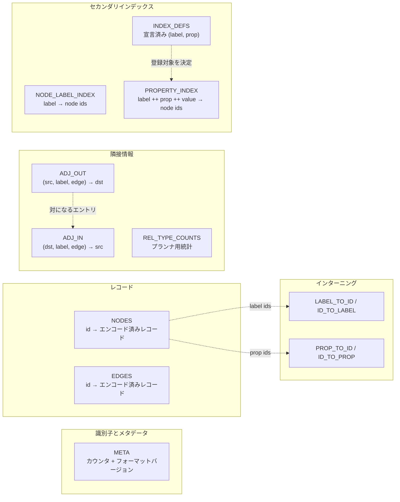

# ストレージ層

MarsDB の永続データは、ひとつの redb ファイルにある 13 個のキーバリュー
テーブルへ格納されます。この章では、ストレージエンジンを扱う
`marsdb-storage/src/lib.rs`、テーブル定義を集めた `tables.rs`、上位層が
読み取りに使うトランザクション抽象 `txn.rs` を説明します。レコード内の
バイト列の意味は次章で扱い、ここでは格納場所とストレージが保証する性質に
焦点を当てます。

## redb の概要

[redb](https://github.com/cberner/redb) は Rust で実装された組み込み
キーバリューストアです。LMDB と同じ系統に属し、copy-on-write B-tree と
MVCC スナップショットをひとつのファイルで管理します。MarsDB は次の機能を
利用します。

- **型付きテーブル。** キーと値の型をコンパイル時に指定します
  （`TableDefinition<u64, &[u8]>`）。並べ替えとシリアライズは redb が
  行います。multimap table では、ひとつのキーに値の集合を対応づけます。
- **トランザクション。** `ReadTransaction` は一貫したスナップショットです。
  複数の読み取りトランザクションを同時に使用できます。`WriteTransaction` は
  プロセス内で同時にひとつだけ存在し、変更を原子的かつ永続的にコミットします。
- **キー順のアクセス。** 点検索、全件の反復、キー順の範囲走査を利用できます。
  タプルのキーは要素ごとに比較されます。隣接情報の配置はこの性質を使います。
- **定数時間の件数取得。** redb がテーブルごとのエントリ数を管理するため、
  ノード数などを O(1) で取得できます。プランナはこの値をコスト比較に使います。

redb はグラフ、スキーマ、インデックスの更新、クエリを扱いません。これらは
MarsDB の上位層が実装します。

## テーブル一覧

`marsdb-storage/src/tables.rs` が、ファイル内のすべてのテーブルを宣言します。
用途は 5 種類に分かれます。



**識別子とメタデータ。** `META` は文字列キーを使って、次のノード id、次の
エッジ id、ファイル形式のバージョンを保存します。id は単調増加する `u64` で、
再利用しません。データベースを開くときにフォーマットバージョンを確認し、互換性の
ないファイルは型付きエラーで拒否します。

テーブルがひとつもない新規ファイルでは、ひとつのトランザクション内で初期化と
バージョン記録を行います。途中でクラッシュしても、半分だけ初期化された状態は
残りません。一方、既存ファイルのバージョンが未対応なら、内容を読まずに拒否します。

**インターニング。** `LABEL_TO_ID` と `ID_TO_LABEL`、`PROP_TO_ID` と
`ID_TO_PROP` は、ラベル名とプロパティ名を `u32` の id へ変換する双方向の
テーブルです。他のテーブルは文字列ではなく id を保存します。繰り返し現れる
文字列を 4 バイトの値に置き換え、比較も整数同士で行える代わりに、API 境界で
名前と id を一度変換します。`name` や `id` のようなプロパティ名は複数のラベルで
使われるため、ラベルごとではなくデータベース全体で共有します。

**レコード。** `NODES` と `EDGES` は、`u64` の id をエンコード済みレコードへ
対応づけます。レコードにはラベル、端点、プロパティが含まれます。形式は第 3 章で
説明します。

**隣接情報。** グラフ探索には `ADJ_OUT` と `ADJ_IN` を使います。キー形式は
次のとおりです。

```text
ADJ_OUT: (src_node_id, label_id, edge_id) -> dst_node_id
ADJ_IN:  (dst_node_id, label_id, edge_id) -> src_node_id
```

タプルは要素ごとに比較されるため、同じノードのエントリが連続し、その中で
リレーションシップ型ごとにまとまります。`(n)-[:KNOWS]->()` のように型を指定した
展開では、`(node, label, *)` の範囲だけを走査します。計算量は一致する次数に
比例します。型を指定しない場合は `(node, *, *)` まで範囲を広げます。

以前の形式では、`node_id` をキーとする multimap の値をエッジ id 順に並べて
いました。この形式では、型を指定した探索でもノードの全隣接エントリをデコードし、
ラベルを検査する必要があります。計算量は総次数に比例し、高次数ノードほど差が
大きくなります。

入方向と出方向をひとつのテーブルへ混在させず、互いに対応する 2 テーブルへ
分けています。探索方向は実行時に分かっているため、反対方向のエントリを読み飛ばす
必要がなくなります。また、キーにはパックしたバイト列ではなく、redb の固定長
タプルを使います。タプルを `&[u8]` へ変えた実装では、固定スロットへの格納が
使えなくなり、ファイルサイズが 34% 増加しました。

`REL_TYPE_COUNTS` は、`label_id` ごとの有効なエッジ数を保存します。エッジの
作成箇所と削除箇所で更新し、プランナがコストを見積もるためにだけ使います。
値が誤っていても選択する実行計画が最適でなくなるだけで、クエリ結果には影響しません。

**セカンダリインデックス。** `NODE_LABEL_INDEX` は、`label_id` をノード id の
集合へ対応づけ、ラベルを指定した走査に使います。`INDEX_DEFS` はインデックスを
宣言した `(label, property)` の組を記録します。キーが存在すること自体が宣言です。
`PROPERTY_INDEX` には、次の形式でインデックスエントリを保存します。

```text
label_id ++ property_id ++ encoded_value -> node_ids
```

すべてのプロパティインデックスがひとつの物理テーブルを共有します。
`(label, property)` のプレフィックスにより、各論理インデックスのエントリはキー順で
連続します。値には順序を保存するエンコーディングを使います。同じ型の中では、
バイト列の辞書順と値の順序が一致します。そのため `WHERE n.year > 2000` のような
条件を、インデックス全体の走査ではなくキー範囲の走査として実行できます。

## データベースを開く処理

`StorageEngine::open_file` と `open_memory` は、redb を開くほかに 2 つの処理を
行います。`open_memory` は redb のメモリ内バックエンドを使いますが、それより
上のコードはファイル版と同じです。

最初に、前述のフォーマットバージョンを確認します。次に、ひとつの書き込み
トランザクション内で、カタログにある全テーブルを開いて作成し、コミットします。
redb は書き込みモードで初めて開いたときにテーブルを作ります。未作成のテーブルを
読み取ると、空の結果ではなくエラーになります。起動時に全テーブルを作ることで、
読み取り処理は新規の空データベースを特別扱いせずに済みます。

## `Txn`: 2 種類のトランザクションに共通する読み取り処理

redb の `WriteTransaction` と `ReadTransaction` は別の構造体で、共通の
トレイトを実装していません。それぞれの `open_table` は、異なる具体型を返します。
一方、MarsDB の多くの処理が必要とするのは `get`、`iter`、`range` といった
読み取りだけです。同じ関数を、書き込みトランザクション内では未コミットの変更を
参照するために、読み取りトランザクション内では single-writer と競合しないために
使う必要があります。

`txn.rs` は、この違いを 3 つの小さな enum で吸収します。`Txn` はどちらかの
トランザクションへのコピー可能な参照です。`TableHandle` と
`MultimapTableHandle` は、どちらかのトランザクションから開いたテーブルを表します。
各ハンドルが提供する操作は `get`、`iter`、`range`、`len` の 4 つだけです。

redb の `ReadableTable` 全体を実装しないのは、使用しないメソッドまで追加しない
ためです。複合キーの隣接情報でプレフィックス走査が必要になるまで `range` はなく、
プランナが走査コストを比較するために O(1) の件数を必要とした時点で `len` を
追加しました。`txn.rs` が示す 4 操作が、上位層からストレージへ要求する機能の
すべてです。

## バックアップと整合性検査

`backup_to` は、トランザクションとして一貫したコピーを作成します。コピー元で
ひとつの読み取りスナップショットを開き、新規作成した出力ファイルへ全テーブルを
コピーして、最後に一度だけコミットします。出力は `create_new` で開くため、既存
ファイルを上書きしません。失敗した場合は、処理自身が作成した不完全なファイルを
削除します。スナップショットからコピーするため、他の読み取りや書き込みと並行して
オンラインバックアップを実行できます。

`check_integrity` は、まず redb の物理検査でチェックサムと領域割り当てを確認し、
続いて MarsDB の論理的な不変条件を検査します。すべての隣接エントリの端点を
デコードできること、インデックスが有効なノードと実際の値を指すこと、id カウンタが
有効な最大 id 以上であることなどを確認します。

次章ではレコードのバイト列を取り上げ、3 個のラベルと 40 個のプロパティを持つ
ノードがどのように配置され、そのうち 1 個のプロパティを読むときに何が必要かを
説明します。
