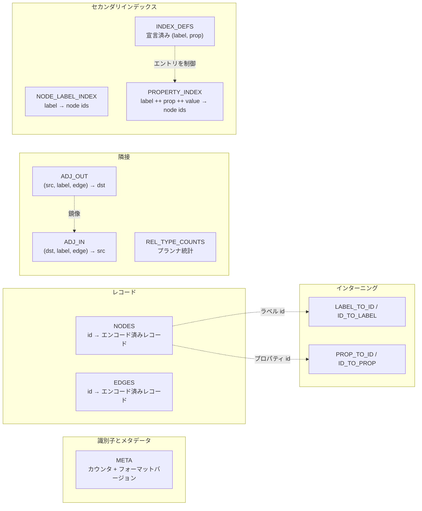

# ストレージ層

MarsDB が知っているすべては、13 のキーバリューテーブルに分かれて
1 つの redb データベースファイルの中にあります。この章はその下の
エンジン(`marsdb-storage/src/lib.rs`)、テーブルカタログ
(`tables.rs`)、そしてシステムの残りが読み取りに使う小さな
トランザクション抽象(`txn.rs`)を説明します。「バイト列が何を
*意味する*か」には踏み込みません — レコードのエンコーディングは
次章です — ここでは「バイトが*どこへ*行き、どんな保証の下に
あるか」に集中します。

## 1 ページで redb

[redb](https://github.com/cberner/redb) は LMDB と同系統の純 Rust
組み込みキーバリューストアです: copy-on-write B-tree として編成された
単一ファイルと、MVCC スナップショット。MarsDB が依存する契約は:

- **型付きテーブル。** テーブルはコンパイル時のキー型・値型で宣言され
  (`TableDefinition<u64, &[u8]>`)、順序づけとシリアライズは redb が
  扱います。multimap テーブルは 1 つのキーを値の*集合*に対応づけます。
- **トランザクション。** `ReadTransaction` は一貫したスナップショットで、
  同時にいくつ存在してもかまいません。`WriteTransaction` は排他的 —
  プロセスで同時に 1 つ — で、原子的かつ永続的にコミットします。
- **順序つきアクセス。** テーブルは点取得、全イテレーション、キー順の
  レンジスキャンをサポートします。タプルキーは成分ごとに順序づく —
  MarsDB の隣接レイアウトが立脚する性質です。
- **安価なカウント。** redb はテーブルごとのエントリ数を追跡するので、
  「ノードは何個あるか」は O(1) です — プランナのコスト比較は
  これに依存します。

redb より上のすべてはこれらをシステムの公理として扱います。redb が
*提供しない*のは、グラフ、スキーマ、インデックス維持、クエリの概念
です — それらは全部 MarsDB です。

## テーブルカタログ

`marsdb-storage/src/tables.rs` がファイル内の全テーブルを宣言します。
5 つのグループに分かれます。



**識別子とメタデータ。** `META` は文字列キーの下に 3 つのカウンタを
保持します: 次のノード id、次のエッジ id、ファイルのフォーマット
バージョン。id は単調に割り当てられる `u64` で、決して再利用され
ません。フォーマットバージョンはオープン時に検査されます: 非互換の
レイアウトで書かれたファイルは型付きエラーできれいに拒否され、
決して中途半端に読まれません。検査は真新しいファイル(テーブルが
まったくない — 初期化してスタンプする。1 つのトランザクションで
原子的に行うので、クラッシュが半初期化ファイルを残せない)と、
未サポートのバージョンを持つ既存ファイル(拒否)を区別します。

**インターニング。** `LABEL_TO_ID`/`ID_TO_LABEL` と
`PROP_TO_ID`/`ID_TO_PROP` は文字列インターニングの対です: ラベル名と
プロパティ名は一度だけ `u32` id に対応づけられ、他のすべての
テーブル間では id を使って参照します。これは、容量と間接参照の
トレードオフです。レコードには繰り返し現れる文字列ではなく固定長の
4 バイト値を格納でき、比較も整数同士で済みます。その代わり、境界で
一度だけ文字列と id を変換する必要があります。
プロパティ名はラベルごとではなくグローバルにインターンされます:
同じ名前(`name`、`id`、...)が多くのラベルにまたがって現れ、
名前空間を分けても得るものがないからです。

**レコード。** `NODES` と `EDGES` は `u64` id をエンコード済み
レコード — ラベル、端点、プロパティ — に対応づけます。エンコードは
第 3 章で扱います。

**隣接。** `ADJ_OUT` と `ADJ_IN` はトラバーサル用テーブルで、その
キーの形はこのファイルで最も重要なレイアウト判断です:

```text
ADJ_OUT: (src_node_id, label_id, edge_id) -> dst_node_id
ADJ_IN:  (dst_node_id, label_id, edge_id) -> src_node_id
```

タプルキーは成分ごとに順序づくので、1 つのノードのエントリは
リレーションシップ型でグループ化されて隣り合います。型付き展開 —
`(n)-[:KNOWS]->()` — は `(node, label, *)` プレフィクスのレンジ
スキャンで、一致するエントリだけに触れます: O(一致次数)。型なし
展開は `(node, *, *)` プレフィクスに広がります。これが置き換えた
代替 — エッジ id 順の `node_id -> 隣接エントリ` multimap — では、
すべての型付き展開がそのノードのエントリ集合*全体*をデコードして
ラベル検査する必要がありました: O(総次数)。グラフが面白くなる
場所(高次数ノード)でちょうど痛くなる性質です。さらに 2 点が
意図的です: テーブルが方向フラグ付きの 1 本ではなく方向別の鏡像で
あること(展開は自分の方向を知っているのに、なぜ反対半分を読み
飛ばす必要が?)、そしてキーがパックしたバイト列ではなくネイティブの
固定幅タプルであること — 同じ情報をタプルキーから `&[u8]` に
消去(erase)する変更は、まさにこのコードベースでファイルサイズ
+34% と計測されました。redb の固定スロットパッキングを手放すから
です。

`REL_TYPE_COUNTS`(`label_id -> 生きているエッジ数`)は隣接に付随
します: エッジが生まれる/死ぬ唯一の 2 箇所で維持されるプランナ用
統計です。クエリに*答える*ためには決して参照されず、クエリの
*コストを見積もる*ためだけに使われます。誤った値は最適ではない実行計画を
生むことはあっても、誤った結果は決して生まない。統計にとって正しい
故障モードです。

**セカンダリインデックス。** `NODE_LABEL_INDEX`
(`label_id -> node_ids`、multimap)がラベル絞り込みスキャンを
支えます。`INDEX_DEFS` はどの `(label, property)` 対にインデックスが
宣言されているかを記録し — キーの存在*が*宣言です — `PROPERTY_INDEX`
がエントリを保持します: `label_id ++ property_id ++ encoded_value ->
node_ids`。宣言された全インデックスがこの 1 つの物理テーブルを共有し、
`(label, property)` プレフィクスが redb のキー順の下で各論理
インデックスのエントリを連続に保ちます。値のバイト列は順序保存
エンコーディングを使うので、辞書式バイト比較が同一型内の実際の値
順序と一致します — これがインデックス付き*レンジ*述語
(`WHERE n.year > 2000`)を全インデックス走査ではなくキーレンジ
スキャンにするものです。

## データベースを開く

`StorageEngine::open_file`(または `open_memory` — redb のインメモリ
バックエンド上で同一のコードを実行し、ストレージより上のスタック
全体は違いを見分けられません)は、redb を呼ぶ以外に 2 つの仕事を
します。

第一に、上で述べたフォーマットバージョンのハンドシェイク。第二に、
1 つのコミットされる書き込みトランザクションの中で、カタログの全
テーブルをあらかじめ開きます。つまり、この時点で作成します。redb はテーブルを
最初の書き込みモードオープンで作成し、一度も作成されていない
テーブルを*読む*のは空の結果ではなくエラーです。すべてを前もって
作っておくことで、システム内のどの読み取りパスも「真新しい、まだ
空のデータベース」を特別扱いする必要がなくなります。オープン時の
十数行が、他のあらゆる場所の `if テーブルが存在すれば` 検査の
一族を消し去るのです。

## `Txn`: 2 つのトランザクション型に 1 つのコードパス

redb の `WriteTransaction` と `ReadTransaction` は共通トレイトを
持たない無関係な構造体です — それぞれの `open_table` は固有
メソッドで、異なる具体型を返します。しかし MarsDB のコードの大半は
*読む*だけで(`get`/`iter`/`range`、決して `insert` しない)、同じ
読み取り関数が、書き込み文のトランザクションの中(自身の未コミットの
書き込みを見るため)でも、読み取り文のスナップショットの中
(single writer と競合しないため)でも動く必要があります。

`txn.rs` はこの分裂を 3 つの小さな enum で覆います: `Txn`(どちらかの
トランザクション種別へのコピー可能な参照)と
`TableHandle`/`MultimapTableHandle`(どちらかのテーブル種別)。
それぞれが 4 つの操作をディスパッチします: `get`、`iter`、`range`、
`len`。抽象はそれで全部です。redb の `ReadableTable` トレイト全体の
実装では意図的に*ありません* — トレイト全体に合わせるのは誰も
呼ばないメソッドのための定型コードが増えるだけです。各メソッドは呼び出し側が
要求したから存在します: `range` は複合キー隣接がプレフィクス
スキャンを必要とするまで完全に省かれており、`len` はプランナが
スキャンコストを比較する O(1) 濃度を必要としたときに足されました。
API は実際の必要に応じてだけ拡張します。そのため、`txn.rs` を
読めば、上位システム全体がストレージに求めるものが正確にわかります:
点取得、順序つきイテレーション、順序つきレンジスキャン、カウント。
プリミティブ 4 つです。

## バックアップと整合性

`backup_to` はトランザクション的に一貫したコピーを作ります: ソースの
読み取りスナップショットを 1 つ開き、全テーブルを新規作成した宛先
ファイルにコピーし、一度だけコミットします。宛先は `create_new` で
開かれ — 既存ファイルを黙って上書きすることは決してなく — 失敗した
バックアップは自分の不完全なファイルを削除します(`create_new` が
そのファイルは自分のものだと証明済みだからこそ安全)。コピーは
スナップショットから駆動されるので、他の読み取りと書き込みが進行
する間も実行できます。MVCC のおかげでホットバックアップがただで
ついてくるのです。

`check_integrity` は 2 段の検査を重ねます: redb 自身の物理検証
(チェックサム、アロケーション)、次に MarsDB の論理不変条件 —
すべての隣接エントリの端点がデコードできる、インデックスエントリが
実際にその値を持つ生きたノードを指す、カウンタがすべての生きている
id を上回る。物理検査はエンジンを信頼し、論理検査は誰も信頼しません。
バグ報告が破損の匂いをさせたとき手に取る道具です。

ファイルの形が定まったので、次章はレコードのバイト列を開きます:
3 つのラベルと 40 のプロパティを持つノードは実際どう並び、そこから
1 つのプロパティを読むのに何がかかるのか。
