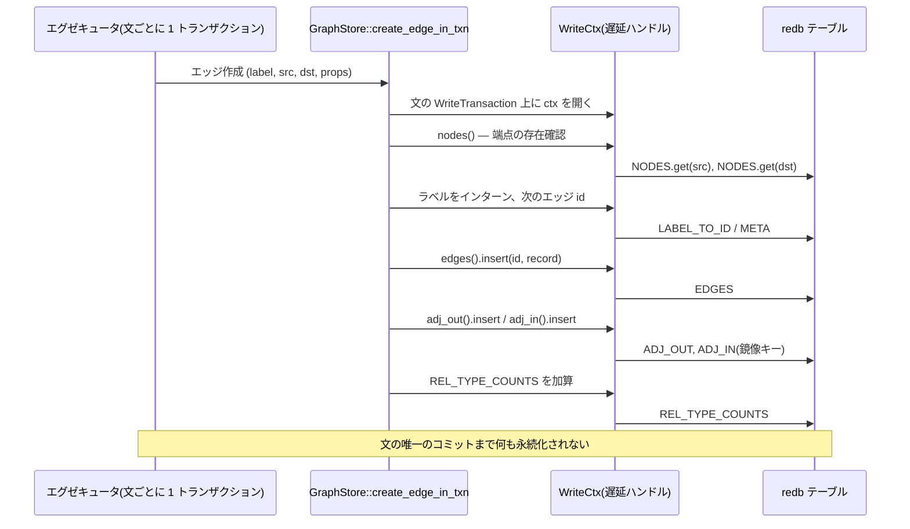

# 書き込みパス

たった 1 つの `CREATE (a:Person {name: 'Alice'})-[:KNOWS]->(b)` が
13 テーブルのうち 9 つに触れます: レコード 2 件、鏡像の隣接 2 件、
統計カウンタ、最大 4 件のインターニングエントリ、ラベルごとの
ラベルインデックスエントリ、そしてラベルの宣言済みインデックスが
要求するプロパティインデックスエントリ。この章は `marsdb-graph` が
それら全部を儀式なしに一貫に保つ方法です: `store.rs`(CRUD 層)と
`write_ctx.rs`(すべての書き込みが乗るテーブルハンドルキャッシュ)。

## 操作ごとに 3 層

すべてのミューテーション操作は同じ 3 つの形で存在します。ノード作成を
例にすると:

- `create_node` — 公開の便宜形: 書き込みトランザクションを開き、次の
  層を呼び、コミット。1 操作 = 1 トランザクション。
- `create_node_in_txn` — 呼び出し側が渡す `&WriteTransaction` を
  取ります。クエリエグゼキュータが呼ぶのはこれです: エグゼキュータは
  文ごとに 1 つのトランザクションを所有し、文が行うすべてのグラフ
  操作がそこを流れます。
- `create_node_ctx` — 内部用、`&mut WriteCtx` を取ります。実際の
  仕事はここにあり、そして合成点でもあります: 別の操作を必要とする
  操作は `_ctx` 形を直接呼び、両者が 1 組のテーブルハンドルを共有
  します。

この層構造はスタイルの好みではなく、実在する制約への答えです。redb は
1 つの書き込みトランザクションが同じテーブルへの生きたハンドルを 2 つ
持つと実行時エラー(`TableAlreadyOpen`)になります。ノード削除は
接続エッジの削除を伴わねばなりません。もしノード削除が公開の
エッジ削除ラッパを呼べば、各呼び出しが同じトランザクション上に新しい
ハンドル一式を開き、ノード削除が既に持っているものと衝突します。
`_ctx` 層は、複合操作が 1 つのハンドル集合の*内側で*合成できるために
存在します。

## `WriteCtx`: 遅延ハンドル、計測済み

`WriteCtx` は 13 個の `Option<Table>` フィールドとアクセサメソッドの
構造体です: 最初のアクセスがハンドルを開き、以後のアクセスは再利用
します。ここでの 2 つの判断は計測によって下され、どちらも当初
もっともらしかった選択肢に逆らいました。

**先回りではなく遅延。** 13 個のハンドルを前もって全部開くほうが
綺麗に聞こえます。実在の 9,771 文バルクロードで計測すると、それは
`WriteCtx` 以前のコードより*遅かった*のです(4.89 秒 → 6.35 秒):
ほとんどの呼び出しは一握りのテーブルにしか触れず
(`set_edge_prop_in_txn` はちょうど 1 つ)、使わないハンドルを
先回りで開くコストが、それが省くはずだった重複オープンを上回り
ました。遅延アクセスなら呼び出しは実際に使うテーブルの分だけ払い、
それでいて 1 回の呼び出しが行っていた*繰り返し*オープンは畳み込み
ます — ノード作成はかつて `NODES` を 1 回、ラベルインデックスを
ラベルごとに 1 回開き、その上にプロパティインデックスフックが
さらに 4 テーブルを開き直していました。テーブルオープンはノイズでは
ありません: 同じバルクロードのプロファイルは総時間の 23.67% を
それに帰しています。

**トランザクションではなく 1 操作スコープ。** キャッシュを文や
トランザクション全体に広げればさらにオープンを節約できます — しかし
書き込みが進行中に起こりうるあらゆる*読み取り*(`WHERE` 内の
プロパティ参照、サブクエリ評価)が同じキャッシュ済みハンドルを
経由する必要が生じ、さもなくばキャッシュが避けるはずのまさにその
`TableAlreadyOpen` に当たります。それは 2 クレートにまたがる
読み書きインターリーブの再設計であり、キャッシュのスコープは
「収まりのよい変更」が終わる場所で止まります。どこで止まるかを
知ることもまた設計判断であり、これは次の人が再発見するに任せず
モジュールヘッダに文書化されています。

## ミューテーションの解剖

**ノード作成**: 各ラベルをインターンし、id を割り当て(`META` の
カウンタ加算 — 呼び出し側がコミットして初めて永続化されるので、id
割り当てはそれが名づけるレコードと同じクラッシュ安全性境界の内側に
あります)、レコードをエンコードし(副作用としてプロパティ名を
インターン)、`NODES` に挿入し、ラベルごとに `NODE_LABEL_INDEX`
エントリを足し、新しいノードをプロパティインデックスフック
(`index::on_node_created`)に渡します。フックは宣言済みインデックスの
ある `(label, prop)` 対のエントリを追加します。

**エッジ作成**: 両端点の存在を確認し(id が再利用されない以上、
書き込みパスに必要な参照整合性検査はこれだけです)、型をインターンし、
id を割り当て、レコードを挿入し、鏡像の隣接エントリ 2 件 —
`ADJ_OUT` に `(src, label, edge) → dst`、`ADJ_IN` に
`(dst, label, edge) → src` — を入れ、型のエッジ数を加算します。

**エッジ削除**はその逆で、ディレクトリエンコーディングが書き込み
パスでも元を取る詳細が 1 つあります: クリーンアップに必要なのは
ヘッダ — 型、src、dst — だけです。2 つの隣接キーを計算するのに
ちょうどそのバイトだけを読み、プロパティのデコードもプロパティ名の
解決も決して行いません。

**ノード削除**は、ノードのプレフィクス境界で両方の隣接テーブルを
レンジスキャンして接続エッジを集めます。接続エッジがあるのに detach
でない削除は、何にも触れる前に型付きエラーで拒否します。
`DETACH DELETE` は各接続エッジを共有 `_ctx` パスで削除し、次に
レコード、ラベルインデックスエントリ、プロパティインデックス
エントリを削除します。報告されるエッジ数はスキャンではなく*削除*から
数えます — 自己ループは両方向の隣接に現れますが削除は 1 回であり、
文の統計は 1 と言わねばならないからです。

**統計カウンタ**(`REL_TYPE_COUNTS`)はちょうど 2 箇所 — エッジの
誕生と死 — で増減し、減る方向では panic せず*飽和*します。不変条件は
大声で、という方針とのこの非対称は意図的で、原則に適っています:
カウンタはプランナ統計であり、誤った値は準最適プランを生むことは
あっても誤答は決して生まない。だからデータベースを落とすのではなく
誤った推定値へ劣化しなければなりません。大声さは不変条件が守るものに
比例するのです。

**バルク削除**(`delete_edges_in_txn`)は `DELETE r` 文のエッジ集合
全体のために存在します: 全 id にわたる 1 つの `WriteCtx`、ラベル名は
エッジごとではなく型ごとに 1 回の解決。壁時計時間ではほぼ中立と計測
されました — 散在するバルク削除のコストはここではなくエグゼキュータの
マッチフェーズにあり、id をテーブルごとのパスにソートする変種も試され
何も動かしませんでした — だから doc コメントに記録された正直な
存在理由は、主張された高速化ではなく、API の形と厳密に少ない冗長作業
です。

## 整合性チェッカーは不変条件の仕様書

`check_integrity` を上のミューテーション群と背中合わせに読むのが、
書き込みパスの契約を身体に入れる最速の方法です。チェッカーは
不変条件を実行可能な散文として書き下したものだからです:

- 両インターニングテーブルは正確な逆写像で、エントリ数が等しい;
- ノード/エッジレコードが参照するすべてのラベル id は解決できる;
- すべてのラベルインデックスエントリはそのラベルを持つ生きたノードを
  指す — そしてすべてのノードのすべてのラベルにはインデックス
  エントリがある(双方向);
- すべてのエッジの端点は生きたノードである;
- すべてのエッジは正しいキーで両方の隣接鏡像に現れる — そして
  すべての隣接エントリはヘッダの一致する生きたエッジに対応する;
- id カウンタは割り当て済み最大 id 以上である。

チェッカーが何を読むかに注目してください: ノードとエッジの*ヘッダ*
だけで、プロパティは決して読みません — 削除パスと同じヘッダのみの
デコードです。そしてその立場にも: 違反はすべて `CorruptData`、
つまりエラーであって修復ではありません。書き込みパスはこれらの
不変条件を構造によって維持します — すべてのミューテーションとその
インデックス簿記は 1 つのトランザクションを共有します — だから違反は
バグを意味し、チェッカーの仕事はそう言うことであって、取り繕うこと
ではありません。

プロパティインデックス — 宣言、バックフィル、一意性、レンジシークを
可能にする順序保存キーエンコーディング — は第 6 章でプランナと併せて
本格的に扱います。次章は `marsdb-query` の頂上へ登ります: Cypher
テキストが検証済み AST になるまで。
