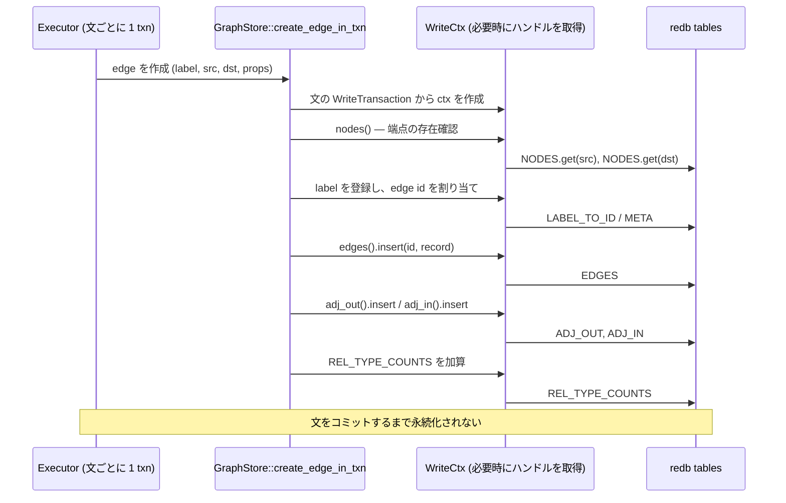

# 書き込み処理

`CREATE (a:Person {name: 'Alice'})-[:KNOWS]->(b)` を 1 回実行すると、13 個の
テーブルのうち最大 9 種類に変更が及びます。ノードとエッジのレコード、入方向と
出方向の隣接情報、統計カウンタ、最大 4 件のインターニング用エントリ、ラベルごとの
ラベルインデックス、宣言済みのプロパティインデックスです。

`marsdb-graph` は、これらをひとつのトランザクション内で更新します。中心となるのは
CRUD を実装する `store.rs` と、書き込み中のテーブルハンドルを管理する
`write_ctx.rs` です。

## 各操作を構成する 3 つの層

更新操作には共通して 3 種類の関数があります。ノード作成の場合は次のとおりです。

- `create_node` — 公開 API 向けの簡易関数です。書き込みトランザクションを開き、
  次の層を呼び、コミットします。1 操作が 1 トランザクションになります。
- `create_node_in_txn` — 呼び出し側が用意した `&WriteTransaction` を受け取ります。
  クエリ実行エンジンは文ごとにひとつのトランザクションを所有し、文に含まれる
  すべてのグラフ操作をこの層から呼びます。
- `create_node_ctx` — 内部実装で、`&mut WriteCtx` を受け取ります。複合操作から
  別の操作を呼ぶ場合は `_ctx` 関数を直接使い、同じテーブルハンドルを共有します。

この 3 層は redb の制約に対応するためのものです。ひとつの書き込みトランザクション
から同じテーブルのハンドルを同時に 2 つ開くと、redb は実行時に
`TableAlreadyOpen` を返します。ノードを削除するときは接続するエッジも削除する
必要があります。ノード削除から公開版のエッジ削除を呼ぶと、同じトランザクションで
新しいハンドルを開き、ノード削除が保持しているハンドルと衝突します。`_ctx` 層を
使えば、複数の操作をひとつのハンドル集合で実行できます。

## `WriteCtx`: 必要なハンドルだけを取得する

`WriteCtx` は 13 個の `Option<Table>` フィールドと、それらへアクセスする
メソッドを持ちます。最初のアクセスでハンドルを開き、同じ操作内の以後のアクセスでは
再利用します。この方式はベンチマーク結果に基づいて選びました。

**ハンドルは最初にすべて開かない。** 13 個を一括して開く方式は実装が単純ですが、
9,771 文のバルクロードでは、`WriteCtx` 導入前の 4.89 秒から 6.35 秒へ悪化しました。
多くの操作が使うテーブルは数個だけです。たとえば `set_edge_prop_in_txn` が必要と
するのは 1 個です。使用しないハンドルまで開く費用が、重複したオープンを省く効果を
上回りました。

必要になった時点で開けば、実際に使うテーブルの分だけ費用が発生します。同時に、
ひとつの操作内で同じテーブルを繰り返し開くことも防げます。以前のノード作成では、
`NODES`、ラベルごとのラベルインデックス、プロパティインデックス処理で使う 4 個の
テーブルを別々に開いていました。同じバルクロードのプロファイルでは、テーブルを
開く処理が総時間の 23.67% を占めていました。

**キャッシュ範囲は 1 操作に限定する。** 文またはトランザクション全体でハンドルを
キャッシュすれば、オープン回数はさらに減ります。しかし、更新中に行うプロパティ
検索やサブクエリ評価も同じキャッシュを経由しなければ、`TableAlreadyOpen` が再び
発生します。これには `marsdb-graph` と `marsdb-query` の読み書きの順序をまとめて
変更する必要があります。現在の `WriteCtx` は、そのような広範囲の変更を伴わずに
安全に適用できる 1 操作だけを対象とします。

## 各更新操作の手順

**ノードの作成**では、まず各ラベルをインターンし、`META` のカウンタから id を
割り当てます。カウンタの更新は呼び出し側のコミットによって初めて永続化されるため、
id とレコードは同じクラッシュ耐性の境界にあります。プロパティ名をインターンしながら
レコードをエンコードし、`NODES` へ追加します。各ラベルについて
`NODE_LABEL_INDEX` も更新し、`index::on_node_created` が宣言済みの
`(label, property)` インデックスへエントリを追加します。

**エッジの作成**では、最初に両端のノードが存在することを確認します。id を再利用
しないため、書き込み時に必要な参照整合性の検査はこれだけです。型名をインターンし、
id を割り当て、`EDGES` にレコードを追加します。続いて
`(src, label, edge) → dst` を `ADJ_OUT`、`(dst, label, edge) → src` を
`ADJ_IN` へ追加し、型ごとのエッジ数を増やします。

**エッジの削除**は、作成と逆の順序で関連エントリを取り除きます。隣接キーの計算に
必要なのは型、src、dst だけなので、レコードのヘッダだけを読みます。プロパティの
デコードやプロパティ名の解決は行いません。第 3 章のディレクトリ形式は、削除時にも
不要なデコードを避けるために使われます。

**ノードの削除**では、ノード id のプレフィックス範囲を使って `ADJ_OUT` と
`ADJ_IN` を走査し、接続しているエッジを集めます。エッジが存在する通常の削除は、
変更を加える前に型付きエラーで拒否します。`DETACH DELETE` では、共有する `_ctx`
経路から各エッジを削除した後、ノードレコード、ラベルインデックス、プロパティ
インデックスを削除します。

削除したエッジ数は、走査で見つけた件数ではなく、実際に削除した件数から求めます。
自己ループは入方向と出方向の両方に現れますが、削除されるエッジは 1 件だからです。

**型ごとのエッジ数**を保存する `REL_TYPE_COUNTS` は、エッジ作成と削除の 2 箇所
だけで更新します。減算時には panic せず、0 で飽和させます。このカウンタは実行計画の
コスト推定にだけ使われます。値が誤れば性能に影響する可能性はありますが、クエリ結果は
変わりません。そのため、カウンタの不整合によってデータベース全体を停止させません。

**一括削除**の `delete_edges_in_txn` は、`DELETE r` が対象とする全エッジに
ひとつの `WriteCtx` を使います。型名の解決も、エッジごとではなく型ごとに 1 回だけ
行います。経過時間は個別削除とほぼ同じでした。分散したエッジを削除する処理では、
主な費用が実行エンジンのマッチ処理にあるためです。id をテーブルごとに並べ替えて
処理する方式も試しましたが、改善しませんでした。この API は高速化ではなく、呼び出し
方法を単純にし、重複作業を減らすために残しています。

## 整合性チェッカーが検査する不変条件

`check_integrity` は、書き込み処理が維持すべき条件を実行可能な形で定義しています。
次の項目を検査します。

- ラベル名とプロパティ名の双方向テーブルが正確な逆写像で、件数も等しいこと
- ノードとエッジのレコードが参照するすべてのラベル id を名前へ戻せること
- 各ラベルインデックスが、そのラベルを持つ有効なノードを指し、各ノードの全ラベルに
  対応するインデックスエントリがあること
- 各エッジの両端が有効なノードであること
- 各エッジが正しいキーで `ADJ_OUT` と `ADJ_IN` の両方に存在し、各隣接
  エントリに対応する有効なエッジがあること
- id カウンタが、割り当て済みの最大 id 以上であること

チェッカーが読むのはノードとエッジのヘッダだけで、プロパティはデコードしません。
削除処理と同じヘッダ専用のデコードを使います。不変条件に違反していれば
`CorruptData` を返し、自動修復は行いません。各更新とインデックス管理はひとつの
トランザクションで行われるため、違反は実装上の不具合またはデータ破損を示します。

プロパティインデックスの宣言、既存データへの作成、ユニーク制約、範囲検索を可能に
する順序保存エンコーディングは、第 6 章でプランナとともに説明します。次章では
`marsdb-query` のフロントエンドを取り上げ、Cypher の文字列が検証済み AST に
なるまでを説明します。
