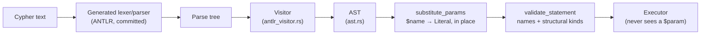

# The Query Frontend

Everything between Cypher text and a validated, executable AST lives at
the top of `marsdb-query`: an ANTLR grammar (`grammar/CypherLexer.g4`,
`grammar/CypherParser.g4`), the generated parser (`src/generated/`), a
visitor that builds the AST (`antlr_visitor.rs`, the largest file in
the frontend), parameter substitution (`params.rs`), and a semantic
validation pass (`semantic.rs`). The public surface is three
functions: `parse` (one statement), `parse_many` (a `;`-separated
script), and `substitute_params`.

## Grammar and parse tree

The grammar is a hand-maintained openCypher subset split conventionally
into lexer and parser files, compiled by ANTLR into a Rust
lexer/parser pair that is generated ahead of time and committed —
building MarsDB does not require a Java toolchain.

The AST builder implements ANTLR's generated visitor trait rather than
manually walking parse-tree accessors. The difference matters for
alternation-heavy grammars: a rule like `literal : boolLit | numLit |
NULL | stringLit | listLit | mapLit` would otherwise need a
hand-written `if let Some(x) = ctx.boolLit() ... else if ...` chain at
every use, while the visitor's double dispatch routes to the right
`visit_X` method for whichever alternative is actually present. The
generated trait imposes one notable constraint: a single return type
for the *entire* tree walk, so the builder threads one shared
`AstNode` enum through every visit method, growing a variant per AST
node kind.

## The AST encodes planner-relevant shape

`ast.rs` shows how the AST supports planning. Its `Expr` type
distinguishes comparison shapes *by
what the planner can later do with them*, not just by what they mean.

- `Compare(prop, op, literal)` — a property against a constant. This
  narrow shape is the only one eligible for the planner's index-seek
  rewriting later.
- `PropCompare(prop, op, prop)` — a property against another property.
  Never index-eligible (there is no constant to seek), always a
  post-scan filter.
- `GeneralCompare(expr, op, expr)` — anything wider: function calls,
  arithmetic, bare variables. Same evaluation machinery as projection
  expressions, same "never index-eligible" stance.
- `VarEq(a, b)` — node/relationship *identity* comparison, distinct
  from comparing properties. The planner also synthesizes it for
  bound-variable repetition in patterns: in `MATCH (a) ... OPTIONAL
  MATCH (b)-[:KNOWS]-(a)`, the second `a` must mean "this same node,"
  and `VarEq` is how that constraint survives into the plan.
- `HasLabel(var, label)` — synthesized for the second and later labels
  of a multi-label pattern (`(n:Post:Message)` — the scan handles one
  label, the filter checks the rest) and also written directly by
  users (`WHERE n:Post`).

A frontend that flattened all of these into one generic
`Compare(expr, op, expr)` would be smaller — and would force the
planner to re-derive, by structural inspection, exactly the
distinctions the AST preserves for free. Keeping the narrow shapes
narrow is what makes the later index-seek rewrite a pattern match
instead of an analysis.

Desugaring happens here too, always toward *fewer* downstream cases:
`IS NOT NULL` parses as `Not(IsNull(..))` rather than a fourth
variant; `WHERE a:A:B` becomes an `And` chain of `HasLabel`s;
`a <> b` becomes `Not(VarEq(a, b))`.

## Parameters are structural, not textual

`substitute_params` walks the AST and replaces every
`Literal::Param(name)` with a concrete literal from the caller's map,
in place, before execution. Two properties fall out of doing this at
the AST level rather than anywhere near text:

First, injection is impossible by construction — a parameter value
becomes a literal *node in an already-parsed tree*; there is no
string context left in which it could mean anything else.

Second, the executor never sees a parameter. The substitution pass is
total (a `$name` with no binding is an error here), so the executor's
literal evaluation treats `Literal::Param` as `unreachable!` — the
invariant is enforced at the boundary and assumed thereafter, which is
the same policy of surfacing invariant violations that the storage
layer applies to its own invariants.

The walk itself is the mechanical price of this design: every
expression-bearing position in every clause must be visited, and a new
AST position means extending the walk. The compiler is the safety net
— an exhaustive match over `Statement` fails to compile when a variant
is added.

## Semantic validation: what a statement can promise before running

`validate_statement` deliberately runs after substitution and before
any storage transaction exists. It checks what is knowable from the
statement alone:

- **Name binding.** Every referenced variable is bound by some pattern
  or projection before use; `WITH` boundaries reset scope to exactly
  their output; each `UNION` arm is scoped independently.
- **Structural kinds.** A small lattice — node, relationship, scalar,
  list-of-kind, map, path, unknown — is propagated through
  expressions, so `MATCH (n)-[r]->() RETURN r.prop + n` fails now,
  not mid-scan.

Some checks are deliberately deferred: property *value* types are
data-dependent and stay runtime
checks (Cypher is dynamically typed at the property level; the same
`n.age` can be an int on one node and a string on the next). Whether
`COMMIT` is valid *right now* is session state, owned by the
`Database` layer, not a static property of the statement. And UNION's
column-compatibility rule needs each arm's real, evaluated column
list, which does not exist before execution — so that one check lives
in the executor.

The pass runs unconditionally, before every execution. Keeping it
storage-free is what makes that affordable: a full-workspace guarantee
that no transaction is ever opened for a statement that could have
been rejected by looking at it.

## Statements and scripts

`parse_many` and `split_statements` handle `;`-separated scripts —
splitting outside string literals, parsing every statement before any
runs (chapter 1 covered the execution semantics). `EXPLAIN` wraps any
statement at the grammar level, producing `Statement::Explain(inner)`
— which the frontend validates by validating `inner`, and which the
executor intercepts to print a plan instead of running one; that plan
rendering is chapter 6's subject, along with the planner that
produces it.
