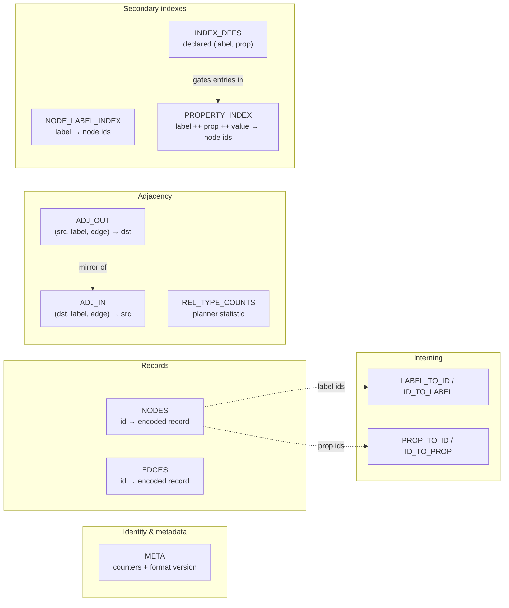

# The Storage Layer

Everything MarsDB knows lives in one redb database file, spread across
thirteen key-value tables. This chapter describes the engine underneath
(`marsdb-storage/src/lib.rs`), the table catalog (`tables.rs`), and the
small transaction abstraction (`txn.rs`) that the rest of the system
reads through. It deliberately stops short of *what the bytes mean* —
record encodings are the next chapter — and focuses on *where bytes go
and under what guarantees*.

## redb in one page

[redb](https://github.com/cberner/redb) is a pure-Rust embedded
key-value store in the same family as LMDB: a single file organized as
copy-on-write B-trees, with MVCC snapshots. Its contract, as MarsDB
relies on it:

- **Typed tables.** A table is declared with compile-time key and value
  types (`TableDefinition<u64, &[u8]>`); redb handles their ordering
  and serialization. Multimap tables map one key to a *set* of values.
- **Transactions.** A `ReadTransaction` is a consistent snapshot; any
  number may coexist. A `WriteTransaction` is exclusive — one per
  process at a time — and commits atomically and durably.
- **Ordered access.** Tables support point gets, full iteration, and
  key-ordered range scans. Tuple keys order component-wise, which is
  the property MarsDB's adjacency layout is built on.
- **Cheap counts.** redb tracks per-table entry counts, so "how many
  nodes exist" is O(1) — the planner's cost comparisons depend on this.

Everything above redb treats these as the axioms of the system. What
redb does *not* provide is any notion of graph, schema, index
maintenance, or query — all of that is MarsDB.

## The table catalog

`marsdb-storage/src/tables.rs` declares every table in the file. They
fall into five groups.



**Identity and metadata.** `META` holds three counters under string
keys: the next node id, the next edge id, and the file's format
version. Ids are `u64`s allocated monotonically and never reused. The
format version is checked at open: a file written by an incompatible
layout is rejected cleanly with a typed error, never half-read. The
check distinguishes a brand-new file (no tables at all — initialize and
stamp it, atomically in one transaction, so a crash cannot leave a
half-initialized file) from an existing file with an unsupported
version (refuse).

**Interning.** `LABEL_TO_ID`/`ID_TO_LABEL` and `PROP_TO_ID`/`ID_TO_PROP`
are string-interning pairs: label names and property names are mapped
to `u32` ids once, and every other table speaks ids. This is the
classic space/indirection trade — records store four fixed bytes
instead of a repeated string, and comparisons become integer
comparisons — at the cost of one lookup to translate at the boundary.
Property names are interned globally rather than per-label: the same
names (`name`, `id`, ...) recur across labels, and separate namespaces
would buy nothing.

**Records.** `NODES` and `EDGES` map `u64` id to an encoded record —
labels, endpoints, and properties. Chapter 3 covers the encoding.

**Adjacency.** `ADJ_OUT` and `ADJ_IN` are the traversal tables, and
their key shape is the single most consequential layout decision in the
file:

```text
ADJ_OUT: (src_node_id, label_id, edge_id) -> dst_node_id
ADJ_IN:  (dst_node_id, label_id, edge_id) -> src_node_id
```

Because tuple keys order component-wise, one node's entries cluster
together, grouped by relationship type. A typed expansion —
`(n)-[:KNOWS]->()` — is a range scan over the `(node, label, *)`
prefix and touches only matching entries: O(matching degree). An
untyped expansion widens to the `(node, *, *)` prefix. The alternative
this replaced — a multimap of `node_id -> adjacency entries` ordered
by edge id — forced every typed expansion to decode and label-check
the node's *entire* entry set: O(total degree), painful exactly where
graphs get interesting (high-degree nodes). Two further details are
deliberate: the tables are direction-separated mirrors rather than one
table with a direction flag (an expansion knows its direction; why
scan past the other half), and the keys are native fixed-width tuples
rather than packed byte strings — erasing tuple keys to `&[u8]` was
measured on this exact codebase at +34% file size, because it forfeits
redb's fixed-slot packing.

`REL_TYPE_COUNTS` (`label_id -> live edge count`) rides along with
adjacency: a planner statistic maintained at the only two places an
edge is created or deleted. It is never consulted to *answer* a query,
only to *cost* one — a wrong value could produce a suboptimal plan but
never a wrong result, which is the right failure mode for a statistic.

**Secondary indexes.** `NODE_LABEL_INDEX` (`label_id -> node_ids`, a
multimap) backs label-filtered scans. `INDEX_DEFS` records which
`(label, property)` pairs have declared indexes — presence of the key
*is* the declaration — and `PROPERTY_INDEX` holds the entries:
`label_id ++ property_id ++ encoded_value -> node_ids`. All declared
indexes share this one physical table; the `(label, property)` prefix
keeps each logical index's entries contiguous under redb's key
ordering. The value bytes use an order-preserving encoding, so
lexicographic byte comparison matches real value ordering within a
type — which is what makes indexed *range* predicates
(`WHERE n.year > 2000`) a key-range scan rather than a full-index walk.

## Opening a database

`StorageEngine::open_file` (or `open_memory`, which runs the identical
code over redb's in-memory backend — the entire stack above storage
cannot tell the difference) does two jobs beyond calling redb.

First, the format-version handshake described above. Second, it
eagerly opens — and therefore creates — every table in the catalog
inside one committed write transaction. redb only creates a table on
first write-mode open, and *reading* a never-created table is an error,
not an empty result. Creating everything up front means no read path
anywhere in the system has to special-case "brand-new, still-empty
database." A dozen lines at open eliminate a whole class of `if
table-exists` checks everywhere else.

## `Txn`: one code path for two transaction types

redb's `WriteTransaction` and `ReadTransaction` are unrelated structs
sharing no trait — `open_table` on each is an inherent method returning
different concrete types. But most of MarsDB's code only ever *reads*
(`get`/`iter`/`range`, never `insert`), and the same reading function
must work inside a write statement's transaction (to see its own
uncommitted writes) and inside a read statement's snapshot (to avoid
contending for the single writer at all).

`txn.rs` papers over the split with three small enums: `Txn` (a copyable
reference to either transaction kind) and `TableHandle`/
`MultimapTableHandle` (either table kind), each dispatching four
operations: `get`, `iter`, `range`, and `len`. That is the entire
abstraction. It is deliberately *not* an implementation of redb's full
`ReadableTable` trait — matching the whole trait would be boilerplate
for methods nothing calls. Each method exists because a call site
demanded it: `range` was left out entirely until the composite-key
adjacency needed prefix scans; `len` was added when the planner needed
O(1) cardinalities to compare scan costs. The surface grows only under
demand. Reading `txn.rs` therefore tells you exactly
what the entire upper system asks of storage: point gets, ordered
iteration, ordered range scans, and counts. Four primitives.

## Backup and integrity

`backup_to` produces a transactionally consistent copy: it opens one
read snapshot of the source and copies every table into a freshly
created destination file, committing once. The destination is opened
with `create_new` — an existing file is never silently overwritten —
and a failed backup removes its own partial file (safe precisely
because `create_new` proved the file was ours). Because the copy is
driven from a snapshot, it can run while other readers and a writer
proceed, so MVCC also enables online backups.

`check_integrity` layers two checks: redb's own physical validation
(checksums, allocation), then MarsDB's logical invariants — every
adjacency entry's endpoints decode, index entries point at live nodes
that actually carry the indexed value, counters exceed every live id.
The physical check trusts the engine; the logical check trusts no one,
and is the tool you reach for when a bug report smells like
corruption.

With the file's shape established, the next chapter opens the record
bytes: how a node with three labels and forty properties actually
lays out, and what it costs to read one property from it.
